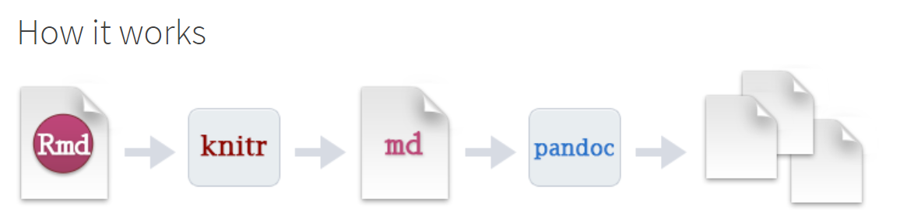
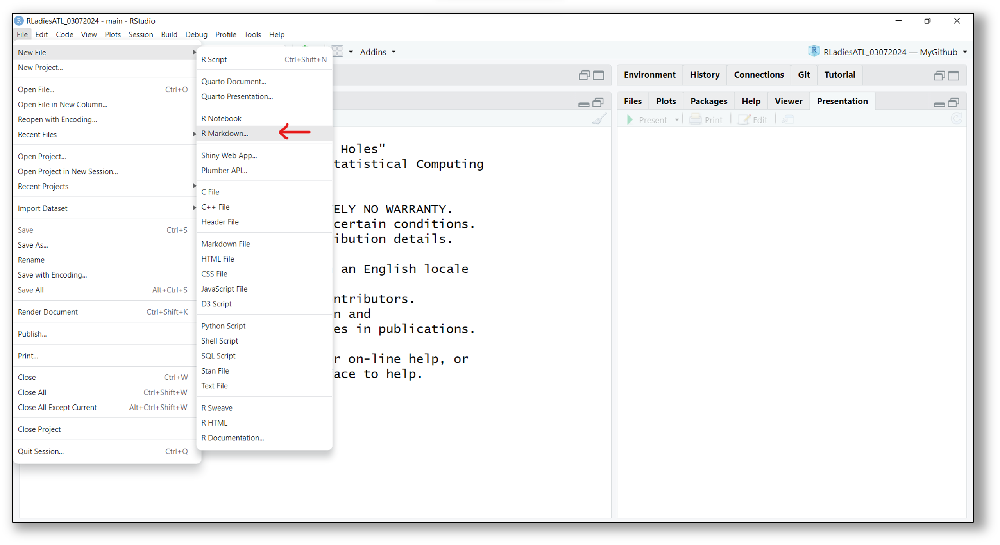
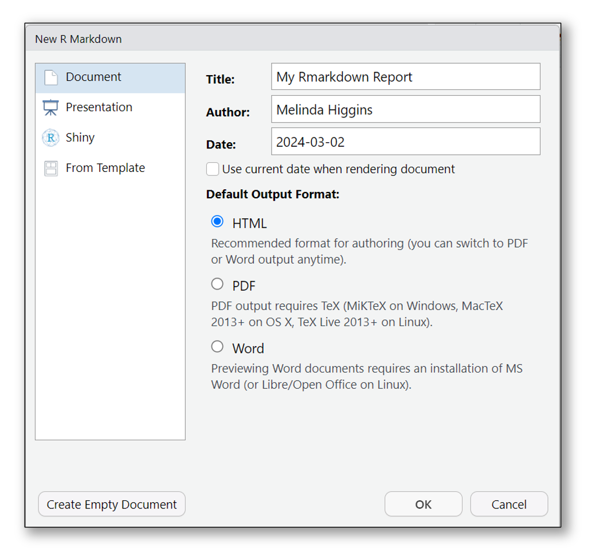
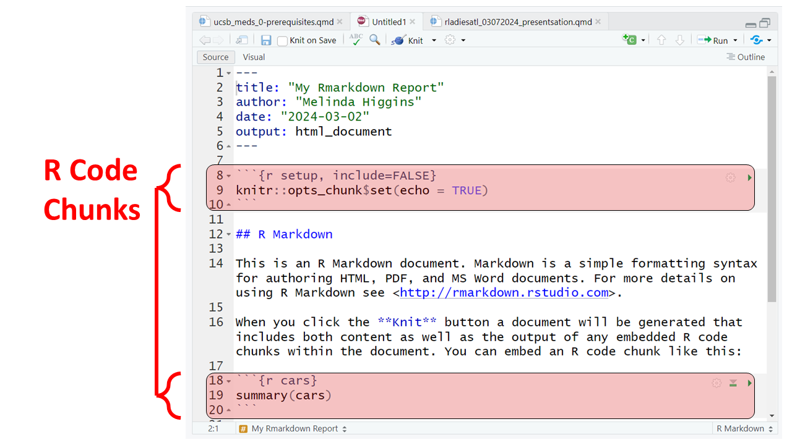
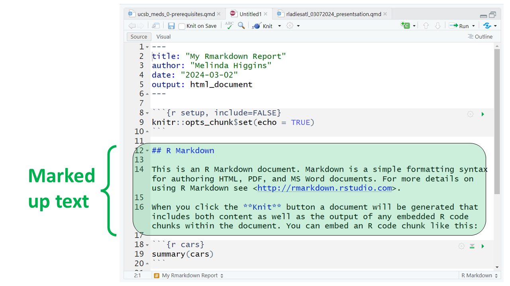
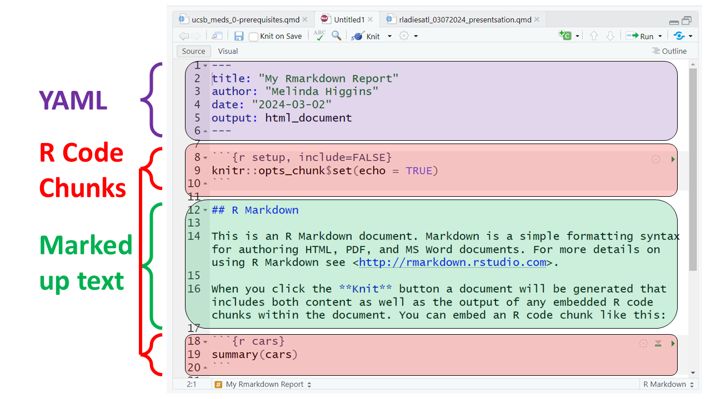
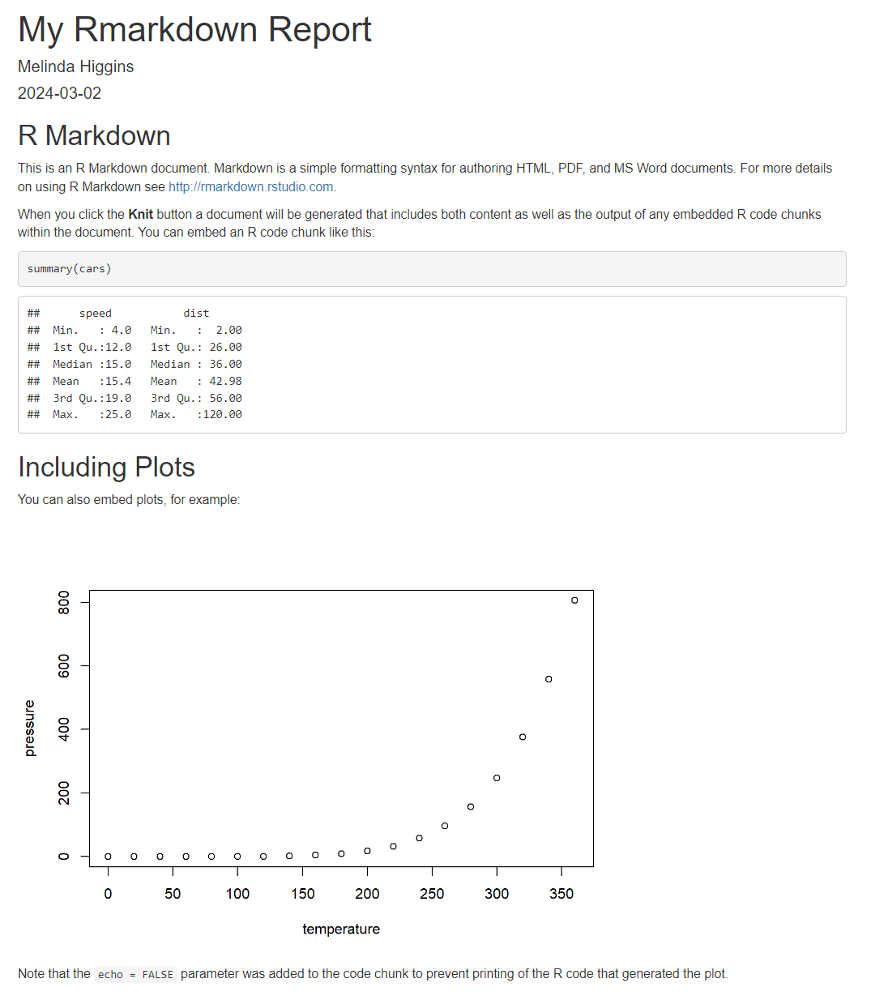
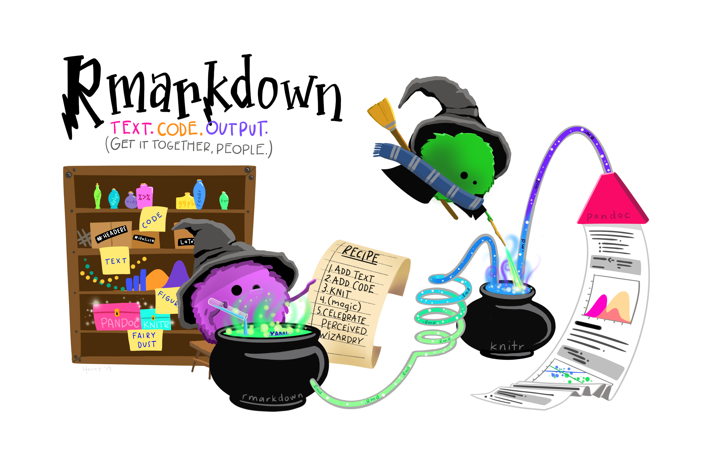

##  {#title-slide data-menu-title="Title Slide" background="#ffffff"}

<!-- background="images/title_background.png" -->

::: {style="text-align: center"}
[R for SAS Users]{.custom-title}

[*Statistical Horizons*]{.custom-subtitle}
:::

::: {style="text-align: center"}
::: columns
::: {.column width="50%"}
[**Event Dates:** May 28-29, 2026]{.body-text-s}
:::

::: {.column width="50%"}
[**Last updated:** `r format(Sys.time(), '%b %d, %Y')`]{.body-text-s}
:::
:::
:::

<hr class="hr-purple1">

<br>

::: {style="text-align: center"}
[Melinda Higgins, PhD.]{.custom-subtitle2}<br> [*Director Biostatistics and Data Core*]{.custom-subtitle3}<br> [*Emory University - School of Nursing*]{.custom-subtitle3}
:::

<br>

::: title-footer
Slides & source code available on [GitHub ](https://github.com/melindahiggins2000/StatisticalHorizons_R4SASUsers)
:::

---

## {#coc-page data-menu-title="Code of Conduct"}

[Compare R and SAS]{.slide-title}

<hr>

:::: {.columns}
::: {.column width="50%"}
::: body-text

### R

* bare bones
* takes up little memory
* 7 powerful base packages
* FREE/Open Source

:::
:::

::: {.column width="50%"}
::: body-text

### SAS

* Have to buy base
* Almost always have to buy add-ons, gets expensive `$$`
* Have to know what you want ahead of time
* Sometimes end up with more than you need

:::
:::

:::

---

## {#mission-page data-menu-title="Mission"}

[R-Ladies Mission]{.slide-title}

<hr>

::: body-text
R-Ladies is a worldwide organization whose mission is to promote gender diversity in the R community.

As a diversity initiative, the mission of R-Ladies is to achieve proportionate representation by encouraging, inspiring, and empowering people of genders currently underrepresented in the R community. R-Ladies’ primary focus, therefore, is on supporting minority gender R enthusiasts to achieve their programming potential, by building a collaborative global network of R leaders, mentors, learners, and developers to facilitate individual and collective progress worldwide.^[[R-Ladies Mission](https://guide.rladies.org/about/mission/)]
:::

---

## {#agenda-page data-menu-title="Tonight's Agenda"}

[Agenda]{.slide-title}

<hr>

::: body-text
**Tonight's Agenda**

* 6:30-7:00 Welcome and Introductions
* 7:00-7:45 RMarkdown Overview and _(brief)_ Introduction to Quarto
* 7:45-8:00 Q&A and Open Discussion - Ideas for Next Meeting(s)

:::

---

## {#intros-page data-menu-title="Introductions"}

[Quick Introductions]{.slide-title}

<hr>

::: body-text
**Introduce Yourselves!**

* Name
* Level of experience with R
* How Best Can R-Ladies Help You?

:::

---

##  {#get-started data-menu-title="Let's Get Started with Rmarkdown" background="#A6A6ED"}

<div class="page-center">
<div class="custom-subtitle">Let's Get Started with Rmarkdown <b>R-</b></div>
</div>

---

## {#whylearn-page data-menu-title="Why Learn RMarkdown?"}

[Why Learn RMarkdown?]{.slide-title}

<hr>



---

## {#rmd-start-page data-menu-title="R Markdown"}

[Learn R Markdown]{.slide-title}

<hr>

[https://rmarkdown.rstudio.com/](https://rmarkdown.rstudio.com/)



::: body-text

When "render" your document, R Markdown feeds the `.Rmd` file to `knitr`, which executes each code chunks and integrates the output into the document as a new markdown (.md) document that includes the code and its output.

The markdown file generated by `knitr` is then processed by pandoc (which is part of RStudio Desktop) which is responsible for creating the finished format. 

Think of Pandoc as the "Swiss Army Knife" for converting documents between different formats [https://pandoc.org/](https://pandoc.org/).

:::

---

## {#rmd-file-page data-menu-title="RStudio Rmarkdown File"}

[Create an Rmarkdown File]{.slide-title}

<hr>



---

## {#rmd-metadata-page data-menu-title="Rmarkdown Metadata"}

[Start Rmarkdown File - Metadata]{.slide-title}

<hr>

:::: {.columns}
::: {.column width="50%"}

:::

::: {.column width="50%"}
::: body-text-s
**To get started, use the built-in template:**

* Type in a title
* Type in your name as author
* Choose and output document format
    - HTML is always a good place to start - **only need a browser to read the output `*.html` file.**
    - DOC usually works ok - **but you need MS Word or Open Office installed on your computer.**
    - PDF **NOTE: You need a TEX compiler on your computer** - Installing the `tinytex` [https://yihui.org/tinytex/](https://yihui.org/tinytex/) R package will work.
:::
:::
:::

---

## {#rmd-sections-page data-menu-title="Rmarkdown Sections s1"}

[Rmarkdown Sections]{.slide-title}

<hr>

:::: {.columns}
::: {.column width="70%"}


:::

::: {.column width="30%"}
::: body-text-s
**Example RMarkdown Template**
:::
:::

::::

---

## {#rmd-sections2-page data-menu-title="Rmarkdown Sections s2"}

[Rmarkdown Sections]{.slide-title}

<hr>

:::: {.columns}
::: {.column width="70%"}


:::

::: {.column width="30%"}
::: body-text-s
**Example RMarkdown Template**

At the top is YAML (yet another markup language).

This of this as metadata for your document. Usually at a minimum is Title, Author and format of document to be rendered.
:::
:::

::::


---

## {#rmd-sections3-page data-menu-title="Rmarkdown Sections s3"}

[Rmarkdown Sections]{.slide-title}

<hr>

:::: {.columns}
::: {.column width="70%"}



:::

::: {.column width="30%"}
::: body-text-s
**Example RMarkdown Template**

The Rmarkdown document combines both R code and "marked-up" text. Here are 2 R code chunks highlighted.

Everything inside ` ```{r} ` down to ` ``` ` is R code. 
:::
:::

::::

---

## {#rmd-sections4-page data-menu-title="Rmarkdown Sections s4"}

[Rmarkdown Sections]{.slide-title}

<hr>

:::: {.columns}
::: {.column width="70%"}



:::

::: {.column width="30%"}
::: body-text-s
**Example RMarkdown Template**

Everything else that is not YAML and is not a code chunk is simple text with "mark-up" syntax added to format text as you would like.
:::
:::

::::

---

## {#rmd-sections5-page data-menu-title="Rmarkdown Sections s5"}

[Rmarkdown Sections]{.slide-title}

<hr>

:::: {.columns}
::: {.column width="70%"}



:::

::: {.column width="30%"}
::: body-text-s
**Example RMarkdown Template**

When we click "Knit", Rmarkdown uses the information in the YAML settings to render the document in the requested format by combining the final formatted text plus the output from the executed code into one final document.

<br>

<br>

NO MORE CUT AND PASTE!!
:::
:::

::::

---

:::: {.columns}
::: {.column width="70%"}



:::

::: {.column width="30%"}
::: body-text-s
<br>

<br>

<br>

<br>

The final rendered document as an HTML document (as viewed in a Browser).
:::
:::

::::

---

##  {#rmd-demo data-menu-title="Rmarkdown (and Quarto) Demo" background="#A6A6ED"}

<div class="page-center">
<div class="custom-subtitle">Live Demo of Rmarkdown and Quarto</div>
</div>

---

##  {#end-page data-menu-title="Happy Reporting"}

::: {.slide-title .center-text}
Happy Reporting!
:::

```{r}
#| eval: true 
#| echo: false
#| fig-align: "center"
#| out-width: "80%" 

```

::: title-footer
Artwork by Allison Horst: [R & stats illustrations by @allison_horst](https://github.com/allisonhorst/stats-illustrations)
:::


---

## {#contact-page data-menu-title="Contact Me"}

[Contact Information]{.slide-title}

<hr>

::: body-text
Feel free to **contact me** with any feedback, concerns or suggestions:

* [melinda.higgins@emory.edu](mailto:melinda.higgins@emory.edu)
* [https://melindahiggins.netlify.app/](https://melindahiggins.netlify.app/)

:::

<br>

::: {.body-text}

**Resources**

* This Presentation was done using Quarto. To learn more, visit <https://quarto.org>.
* Rmarkdown Get Started <https://bookdown.org/yihui/rmarkdown-cookbook/>
* RMarkdown Cookbook <https://rmarkdown.rstudio.com/lesson-1.html>

:::


