\thispagestyle{fancy}

```{r setup, include=FALSE}
knitr::opts_chunk$set(echo = TRUE,
                      error = TRUE,
                      message = FALSE,
                      warning = FALSE)
knitr::opts_chunk$set(
  comment = '', fig.width = 6, fig.height = 6
)
```

## Steps needed to get started

1. Install R
2. Install RStudio Desktop
3. Install R Packages 
4. Run a quick test
5. Download Files from Google Drive
6. Create New RStudio Project

---

## 1. Install R

::: callout-note
## R versus RStudio

Note: [**R**](https://cran.r-project.org/){target="_blank"} is the name of the programming language itself and [**RStudio**](https://posit.co/download/rstudio-desktop/){target="_blank"} is an integrated development environment (IDE) which is an enhanced interface for better organization, files management and analysis workflows.
:::

### Download R from CRAN

The R programming language is maintained and distributed by CRAN [The Comprehensive R Archive Network](https://cran.r-project.org/). They provide the installers for the binary distributions of the base system and contributed packages. R is FREE!

Installation Instructions are provided for these operating systems:

* [Windows](https://cran.r-project.org/bin/windows/)
    - Choose "base" and I suggest you accept the default installation options.
    - OPTIONAL - You may also want "RTools" if you think you may want to do build your own R packages in the future. This is NOT needed for this course.
* [Mac](https://cran.r-project.org/bin/macosx/)
    - Please make note of the specific details on which installer you may need for your version of Mac OS (operating system).
    - I work on a Windows operating system, so please reach out to your local IT support for help getting the correct version installed for your system.
* [Linux](https://cran.r-project.org/bin/linux/)
    - Odds are you are probably using either Windows or Mac OS, but if you using Linux, please read carefully the specific details for your version of Linux.
    


### Other Helpful Resources For Installing R

* [Chapter 1 of Statistical Inference via Data Science: A ModernDive into R and the Tidyverse _(Second Edition)_](https://moderndive.com/v2/getting-started.html) by Chester Ismay, Albert Y. Kim, and Arturo Valdivia.
* [Chapter 3.4 of The Epidemiologist R Handbook](https://epirhandbook.com/en/new_pages/basics.html#installation)

---

\newpage
## 2. Install RStudio Desktop

::: callout-important
## Install R First and RStudio Second

It is important to install the R programming language FIRST. I also encourage you to use the default installation options, so that when you install the RStudio Desktop application, it will "know" where (folder locations) to look for your R installation. 
:::

The RStudio IDE (integrated development environment) software is developed and distributed by the [POSIT Company](https://posit.co/about), which was formerly known as "RStudio" founded in 2009. In 2022 they changed their name to "Posit", however, the name of the software application stayed "RStudio".

For this course, we will be using the RStudio Desktop software. RStudio Desktop is FREE. The "PRO" version does cost money.

You can download RStudio Desktop from [https://posit.co/download/rstudio-desktop/](https://posit.co/download/rstudio-desktop/){target="_blank"}.

I think the website link above will "autodetect" which operating system you have. Mine defaults to the Windows installer. 


However, if you have a Mac you should get the installer for the Mac OS. Regardless, you can always choose the operating system and version you need.


And if you keep scrolling down the webpage you can find older versions of RStudio if/as needed as well.

::: callout-note
## RStudio or Positron?

For this course, I will use the RStudio IDE. However, there is a newer alternative to "RStudio", known as "Positron" which was released in 2025.

\medskip

Learn more about [Positron](https://positron.posit.co/). Positron is also an IDE programming environment, but is designed to accommodate multiple programming environments and multiple sessions at the same time, e.g. you can run both R and Python and manage multiple versions at one time. We will NOT cover these details in this course.

\medskip

Technically, you can also use the RStudio IDE to execute and manage Python programs as well. In fact RStudio can help manage several other programming languages as well.

**User Guides**

* [RStudio User Guide](https://docs.posit.co/ide/user/).
* [Positron User Guide](https://positron.posit.co/welcome.html)
:::


---

\newpage
## 3. Install R Packages Needed for Course 

For this course, you will need to have the following packages installed on your computer. All of these packages are available from [CRAN](https://cran.r-project.org/).

::: callout-note
## R Packages on CRAN

As of 05/16/2026 at approximately 11:00 am EDT USA time, there are currently 23668 packages hosted on CRAN. More get added everyday!
:::


\newpage
For this course, you will need these 16 packages:

1. [`tidyverse`](https://tidyverse.org/packages/) which includes a suite of 9 packages (and a few others as well) that are all installed at the same time:
    - [`ggplot2`](https://ggplot2.tidyverse.org/)
    - [`dplyr`](https://dplyr.tidyverse.org/)
    - [`tidyr`](https://tidyr.tidyverse.org/)
    - [`readr`](https://readr.tidyverse.org/)
    - [`purrr`](https://purrr.tidyverse.org/)
    - [`tibble`](https://tibble.tidyverse.org/)
    - [`stringr`](https://stringr.tidyverse.org/)
    - [`forcats`](https://forcats.tidyverse.org/)
    - [`lubridate`](https://lubridate.tidyverse.org/)
    - [`haven`](https://haven.tidyverse.org/) - _this package is included in tidyvers_
2. [`ggtext`](https://wilkelab.org/ggtext/)
3. [`easystats`](https://easystats.github.io/easystats/) which is also a suite of 10 packages:
    - [`effectsize`](https://easystats.github.io/effectsize/)
    - [`report`](https://easystats.github.io/report/)
    - [`correlation`](https://easystats.github.io/correlation/)
    - [`modelbased`](https://easystats.github.io/modelbased/)
    - [`bayestestR`](https://easystats.github.io/bayestestR/)
    - [`see`](https://easystats.github.io/see/)
    - [`parameters`](https://easystats.github.io/parameters/)
    - [`performance`](https://easystats.github.io/performance/)
    - [`insight`](https://easystats.github.io/insight/)
    - [`datawizard`](https://easystats.github.io/datawizard/)
4. [`gmodels`](https://cran.r-project.org/web/packages/gmodels/index.html)
5. [`gtsummary`](https://www.danieldsjoberg.com/gtsummary/)
6. [`effects`](https://cran.r-project.org/web/packages/effects/index.html)
7. [`emmeans`](https://rvlenth.github.io/emmeans/)
8. [`broom`](https://broom.tidymodels.org/)
9. [`rmarkdown`](https://rmarkdown.rstudio.com/)
10. [`knitr`](https://yihui.org/knitr/)
11. [`tinytex`](https://yihui.org/tinytex/) - _OPTIONAL - needed to "knit to PDF"_
12. [`olsrr`](https://olsrr.rsquaredacademy.com/)
13. [`modelsummary`](https://modelsummary.com/)
14. [`janitor`](https://sfirke.github.io/janitor/)
15. [`data.table`](https://r-datatable.com/)
16. [`arsenal`](https://mayoverse.github.io/arsenal/)

\newpage

To install these packages, the easiest way is to use the RStudio Menu "Tools/Install" Packages interface:

For example, let's install a "new" R package, like `ggplot2`.

Go to the RStudio menu "Tools/Install" Packages

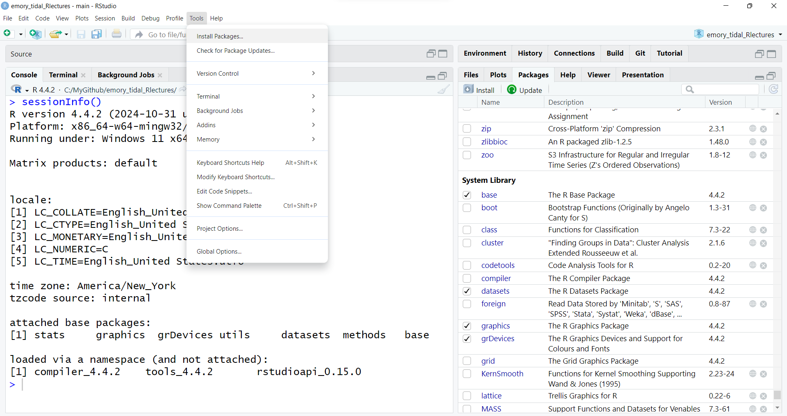  

\newpage

This will then open up a window where you can type in the name of the package you want. As soon as we start typing `ggplot2` the menu begins listing all packages with that partial spelling...

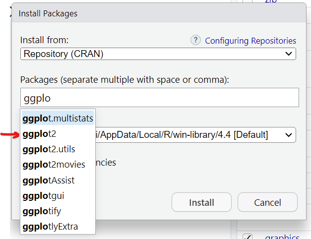

\newpage

You'll notice that there are 3 parts to the installation:

1. Where you want to get the package from _(i.e., which repository - more on repositories later in this course)_.
2. The name of the package. You can actually type more than one package name at a time separated by commas if you want to install several packages at once.
3. The file location on your computer where the new package is installed - your file location will be different than mine. But this is useful to know in case something goes wrong. **I would suggest keeping the default settings.**

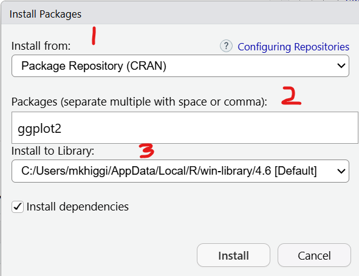

\newpage

After installing `ggplot2` you should see `ggplot2` listed under the Packages window:

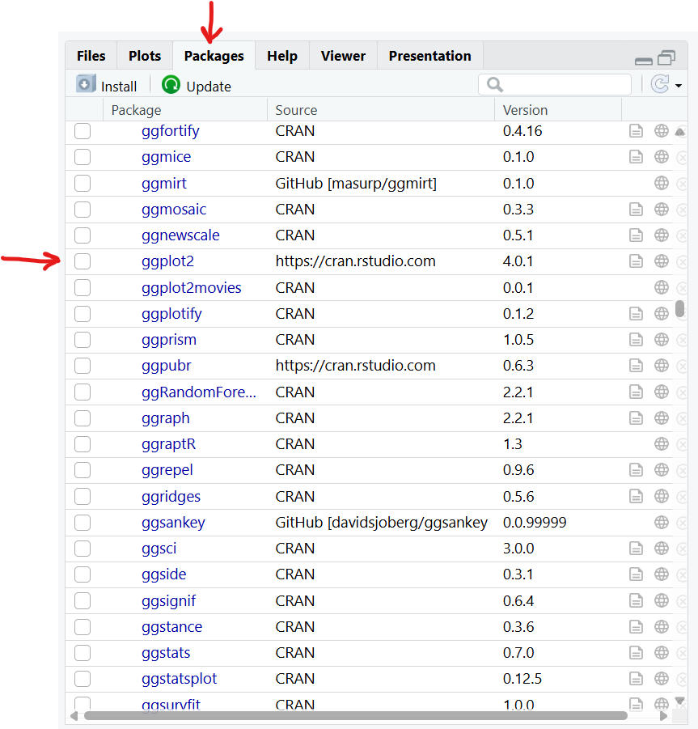

Repeat this process to install the rest of the R packages needed.

\newpage

Note: You can also confirm the installation of the R packages on your computer by going to the folder listed under #3 "Install to library" path listed above -- on my computer my R packages are in this folder on my computer `C:\Users\mkhiggi\AppData\Local\R\win-library\4.6`.

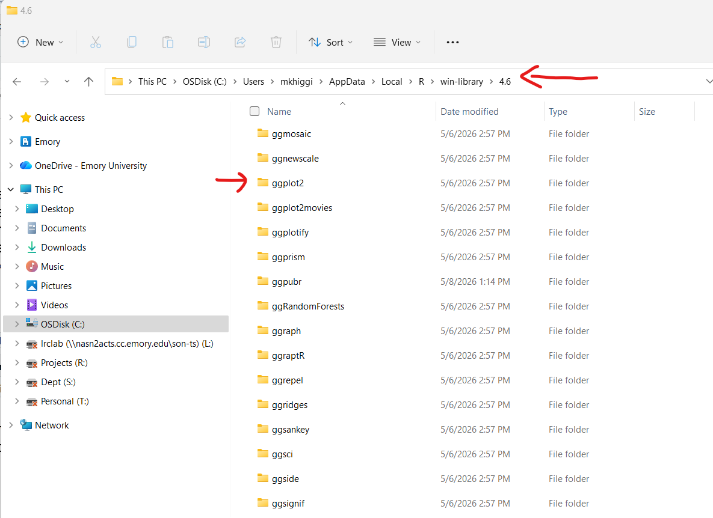


### Learn More About Installing R Packages

* [Chapter 1.3 in Statistical Inference via Data Science: A ModernDive into R and the Tidyverse _(Second Edition)_ ](https://moderndive.com/v2/getting-started.html#packages)


---

\newpage
## 4. Run Quick Check 

Let's confirm that your installation of R, RStudio and your packages are working. For example, let's test that your installation of `ggplot2` is working. Run the following R code as a quick test.

```{r fig.width = 5, fig.height = 5}
library(ggplot2)
ggplot(pressure, aes(temperature, pressure)) +
  geom_point()
```

---

\newpage
## 5. Download Files from Google Drive 

Now that you have R and RStudio ready to go, let's download the files you will need for this workshop.

First, go to the Google Drive [R4SASUsers_Oct2026](https://drive.google.com/drive/folders/1Nnb9pA7g7iRLg9o2yidV2MWMWoDTOcHV?usp=sharing) for this workshop.

Next, click the down arrow next to the folder name and select "Download".

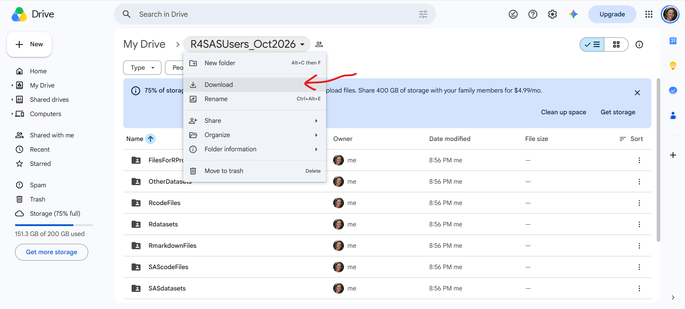

On my computer (Windows 11 operating system) using Google Chrome browser, this downloads a ZIPPED compressed file "R4SASUsers_Oct2026-20261004T010304Z-1-001.zip" - your actual filename may be different. But look for something similar. 

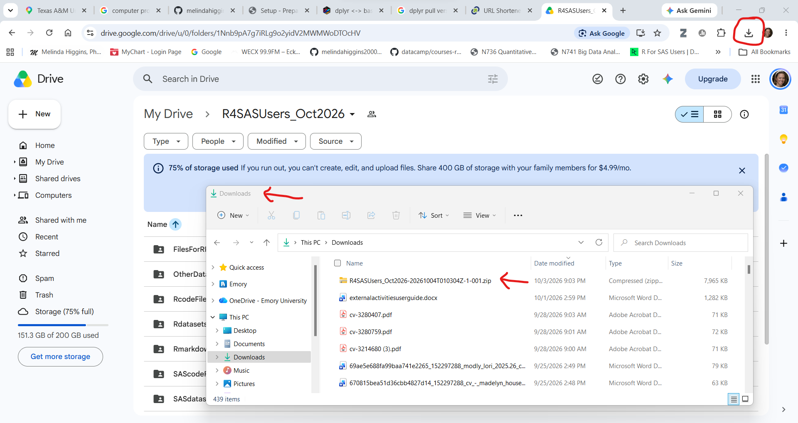

This *.ZIP file actually has all of the files that are on the Google Drive folder all in one compressed file. You have to UNZIP or EXTRACT these files before you can use them. The screenshots below are from a Windows 11 operating system - these may look different on different operating systems (e.g. Linux, Mac), but the process should be similar.

Click on "Extract All"

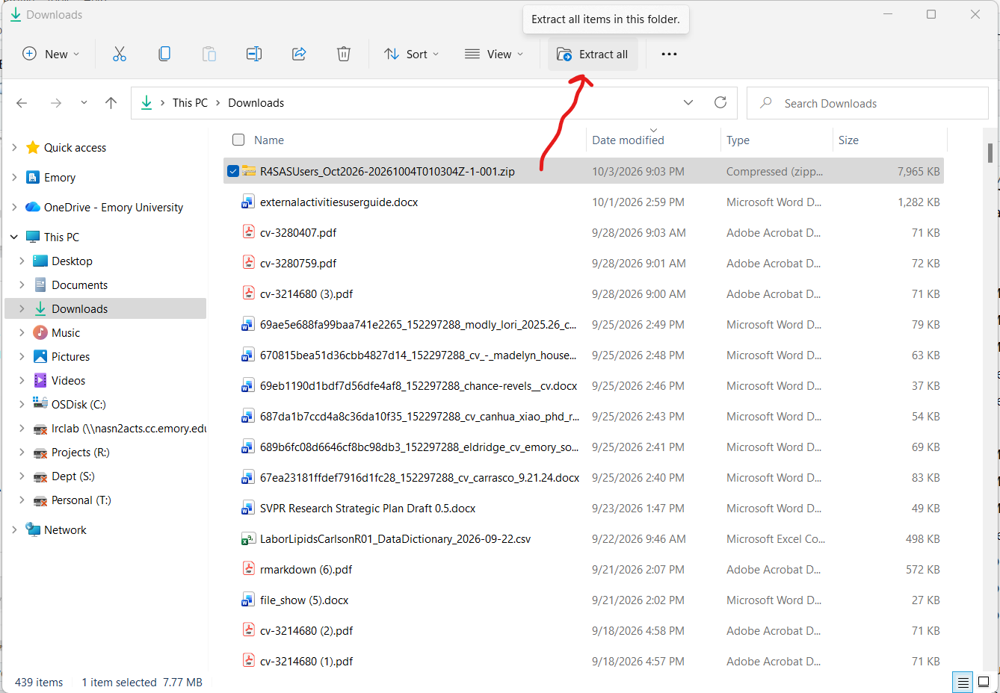

I usually accept the defaults for the folder location, but feel free to change this using "Browse" if you wish. Then click "Extract".

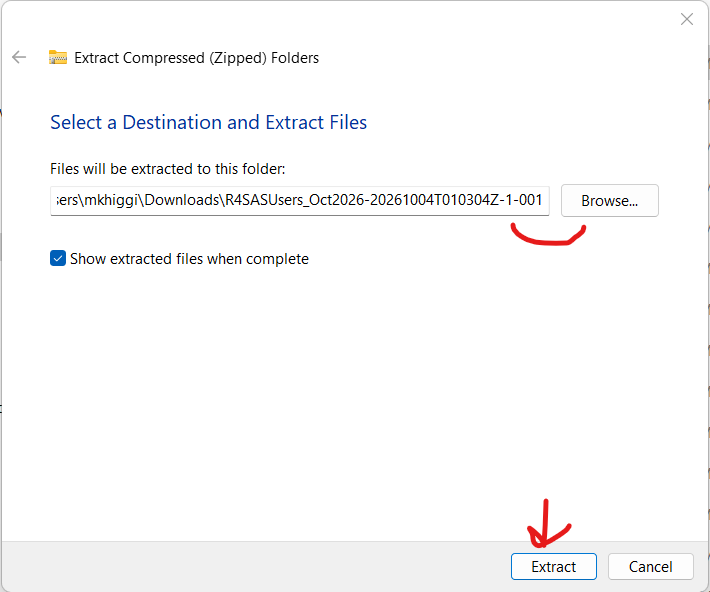

This then extracts all of the original files and places them into this new location on your computer (or cloud or network drive - your choice).

You should now have a new folder on your computer that looks like this:

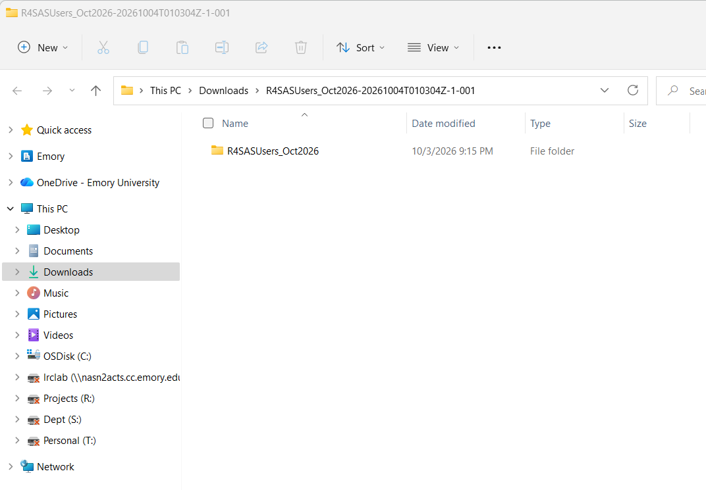

Open this folder. These files and subfolders should now match what was on the Google Drive [R4SASUsers_Oct2026](https://drive.google.com/drive/folders/1Nnb9pA7g7iRLg9o2yidV2MWMWoDTOcHV?usp=sharing).

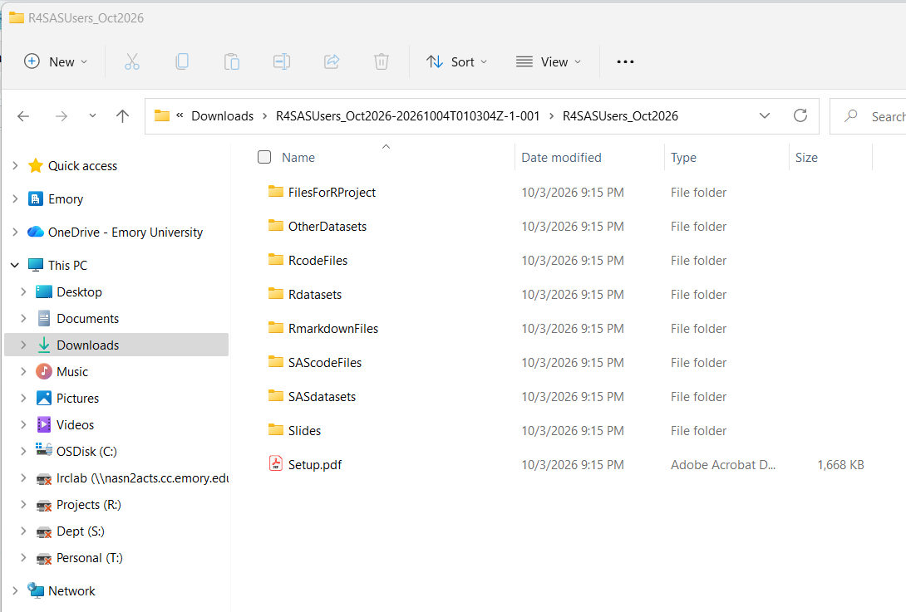

The files contained in this entire folder directory are:

```
│   Setup.pdf
│
├───FilesForRProject
│       aggstats.R
│       aggstats.sas
│       CESDAnalysisReport.Rmd
│       CESDAnalysisReport_byRace.Rmd
│       CESDAnalysisReport_RaceParameters.Rmd
│       d1_homework.R
│       d1_homework_key.R
│       d2_homework.R
│       d2_homework_key.R
│       dat1.Rdata
│       dat1.sas7bdat
│       dat2.Rdata
│       dat2.sas7bdat
│       finddups.R
│       finddups.sas
│       help.csv
│       help.Rdata
│       help.sas7bdat
│       helpmkh.sav
│       letexample.R
│       letexample.sas
│       macroreg.R
│       macroreg.sas
│       module_d1_01.R
│       module_d1_02.R
│       module_d2_01.R
│       Rscript_01.R
│       sascode_d1_02.sas
│       sascode_d2_01.sas
│       saveplots.R
│       treat1.Rdata
│       treat1.sas7bdat
│       treat2.Rdata
│       treat2.sas7bdat
│
├───OtherDatasets
│       help.csv
│       helpmkh.sav
│
├───RcodeFiles
│       aggstats.R
│       d1_homework.R
│       d1_homework_key.R
│       d2_homework.R
│       d2_homework_key.R
│       finddups.R
│       letexample.R
│       macroreg.R
│       module_d1_01.R
│       module_d1_02.R
│       module_d2_01.R
│       Rscript_01.R
│       saveplots.R
│
├───Rdatasets
│       dat1.Rdata
│       dat2.Rdata
│       help.Rdata
│       treat1.Rdata
│       treat2.Rdata
│
├───RmarkdownFiles
│       CESDAnalysisReport.Rmd
│       CESDAnalysisReport_byRace.Rmd
│       CESDAnalysisReport_RaceParameters.Rmd
│
├───SAScodeFiles
│       aggstats.sas
│       finddups.sas
│       letexample.sas
│       macroreg.sas
│       sascode_d1_02.sas
│       sascode_d2_01.sas
│
├───SASdatasets
│       dat1.sas7bdat
│       dat2.sas7bdat
│       help.sas7bdat
│       treat1.sas7bdat
│       treat2.sas7bdat
│
└───Slides
        RforSASUsers_d1_01.pdf
        RforSASUsers_d1_01.pptx
```

Next, we are going to move the files in the subfolder "FilesForRProject" into a new project folder on your computer.

Create a new folder on your computer named "R4SASUsers". Click on New/Folder and name this new folder "R4SASUsers".

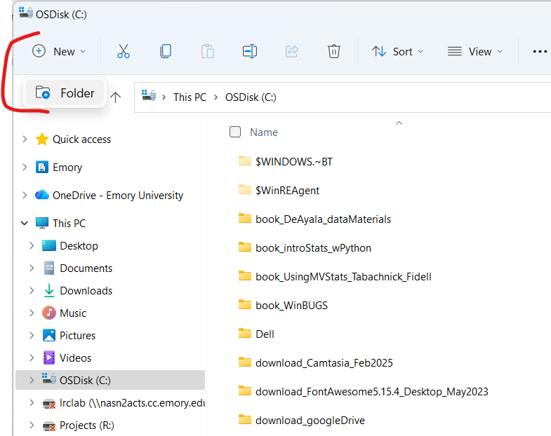

Open another file folder window and go back to where you unzipped the Google Drive files and folders. Then click on the subfolder "FilesForProject" to open it.

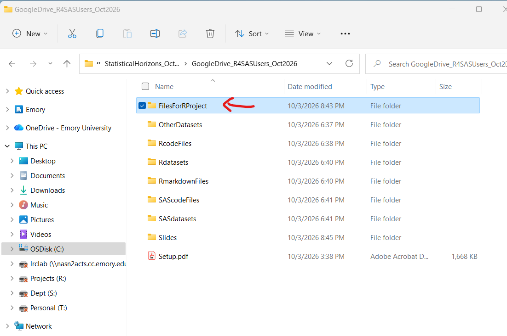

After opening the folder window, click on the 3 dots `...` and choose "Select All"

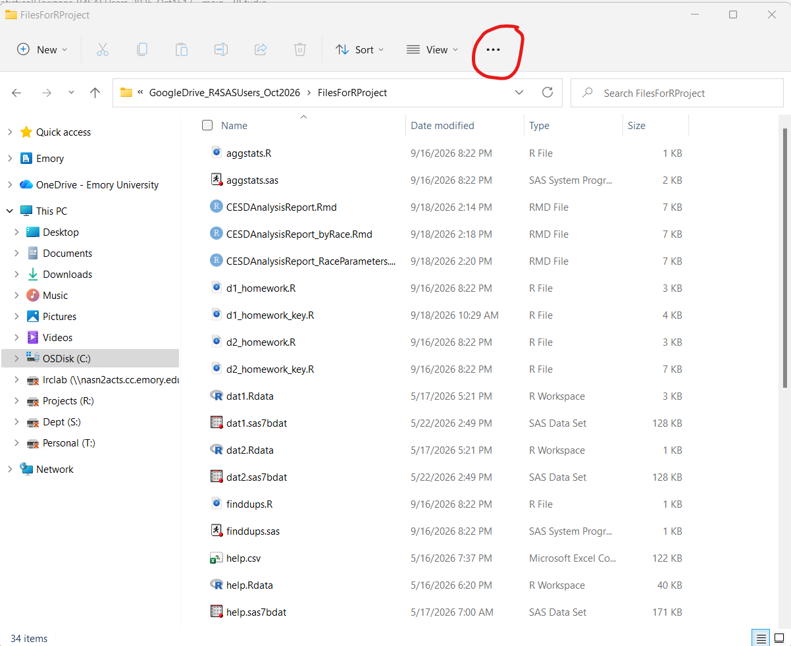

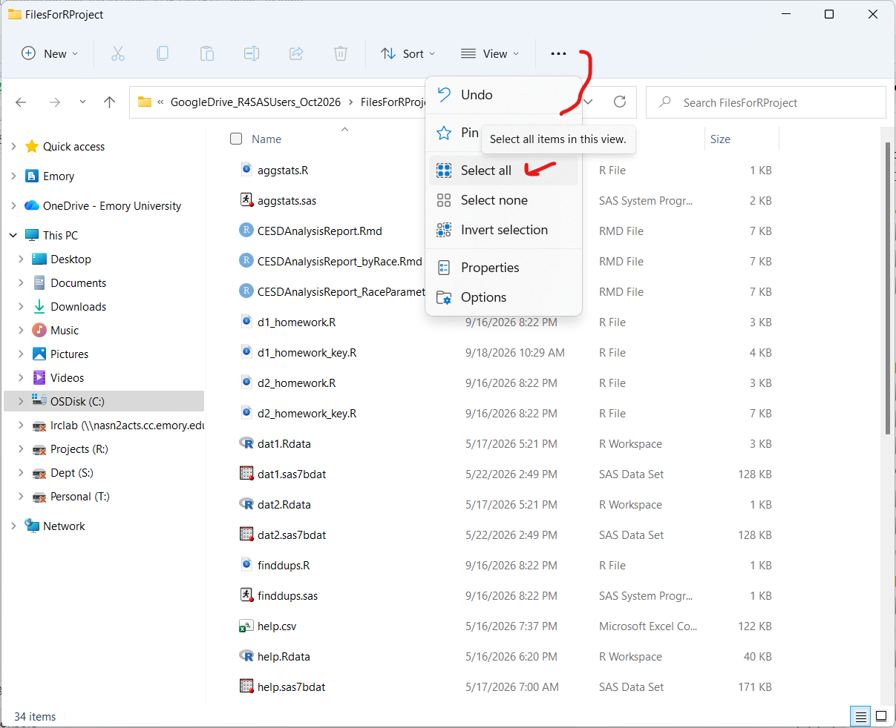

After selecting all of these files, choose COPY.

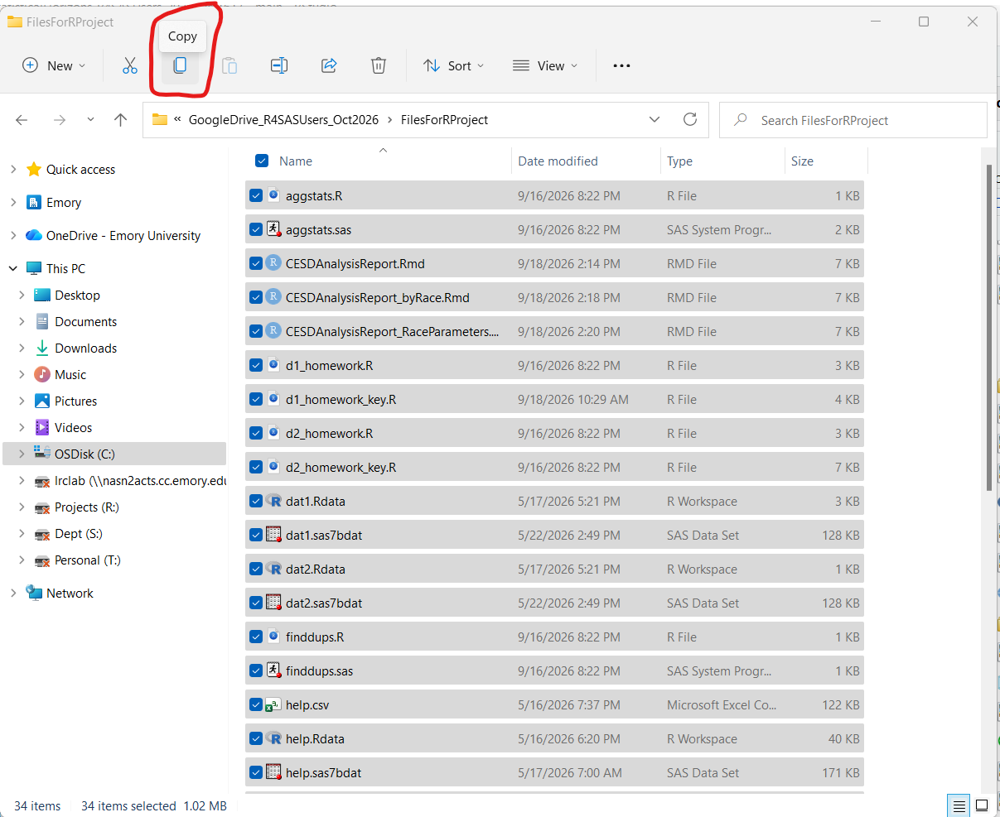

Then open the folder you just created and PASTE all of these files into your new folder.

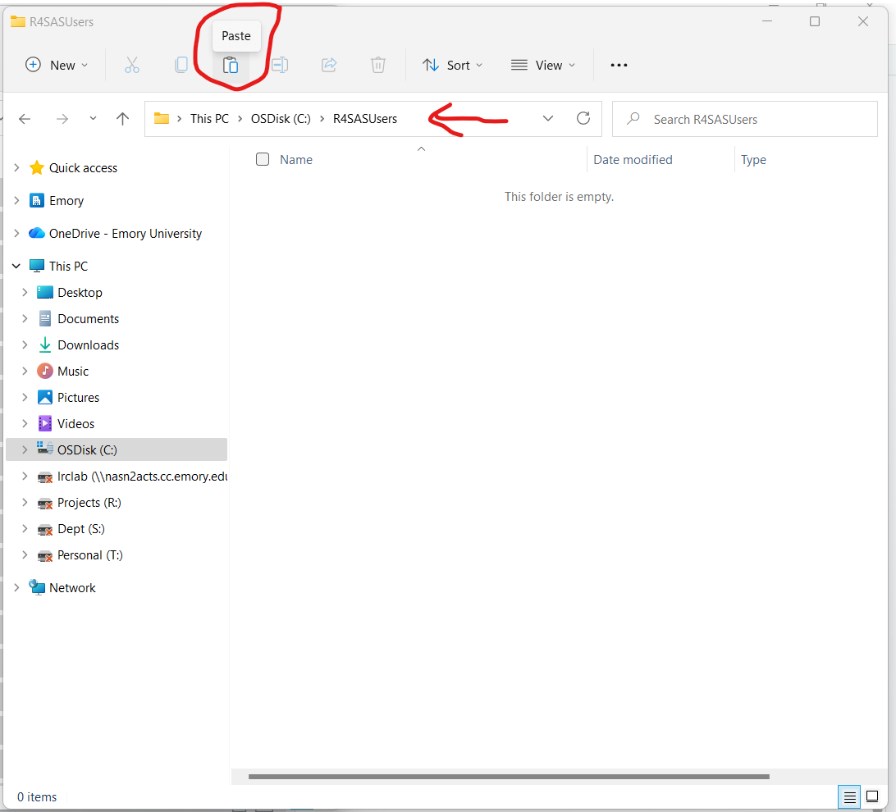

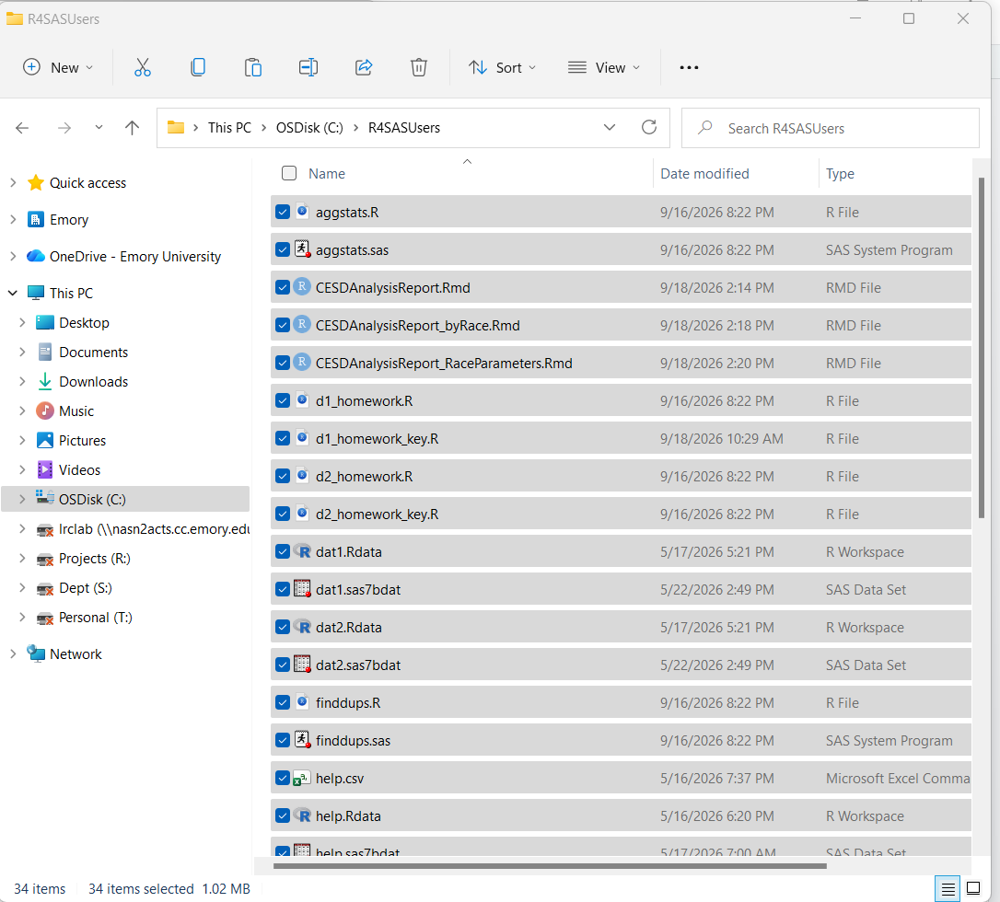

You now have your project folder created for this workshop. On my computer this folder location is `C:\R4SASUsers`.

---

\newpage
## 6. Create New RStudio Project

Start RStudio and then Click on "File/New Project".

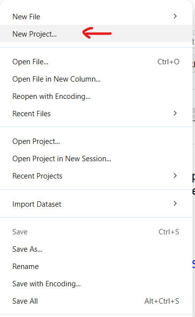

You have 3 options here:

* New Directory
    - if the project folder does not exist yet
    - this is useful for more complicated "projects" like creating website or R packages
* Existing Directory
    - use this option if the folder where all of your project files are stored already exists
* Version Control
    - use this option if you want to bring your project under version control using [Github](https://github.com/) or [Subversion Control (SVN)](https://subversion.apache.org/).

We will use "Existing Directory" since you have already created the project folder on your computer and put your files in there.

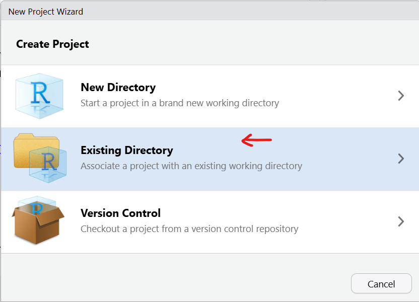

Next you need to select the existing project folder on your computer (or cloud or networked drive) - click "Browse"

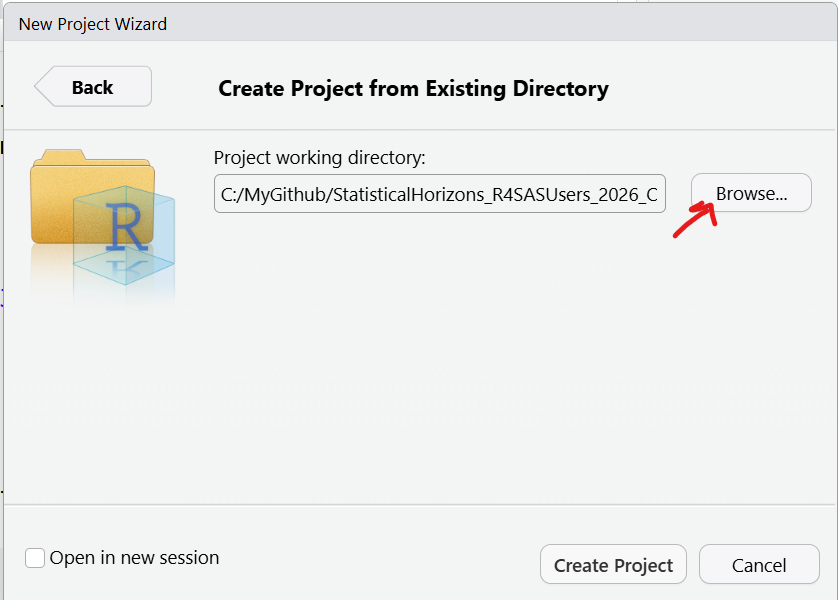

Then go find the folder and click "Open".

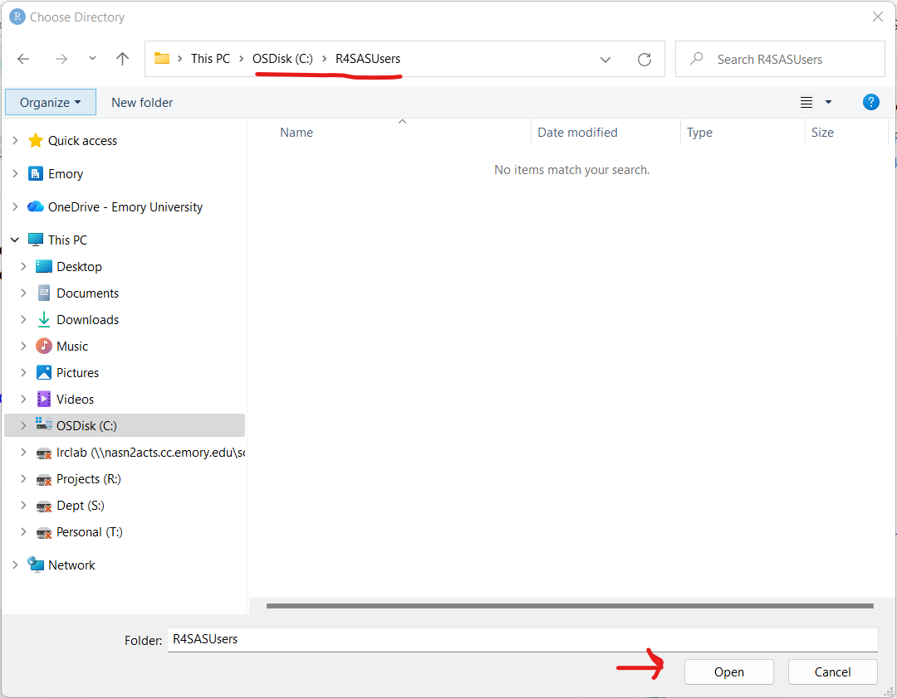

Now check that your "Project working directory" matches the folder you selected - on my computer this is `C:\R4SASUsers`. Then click "Create Project" to create a new RStudio project.

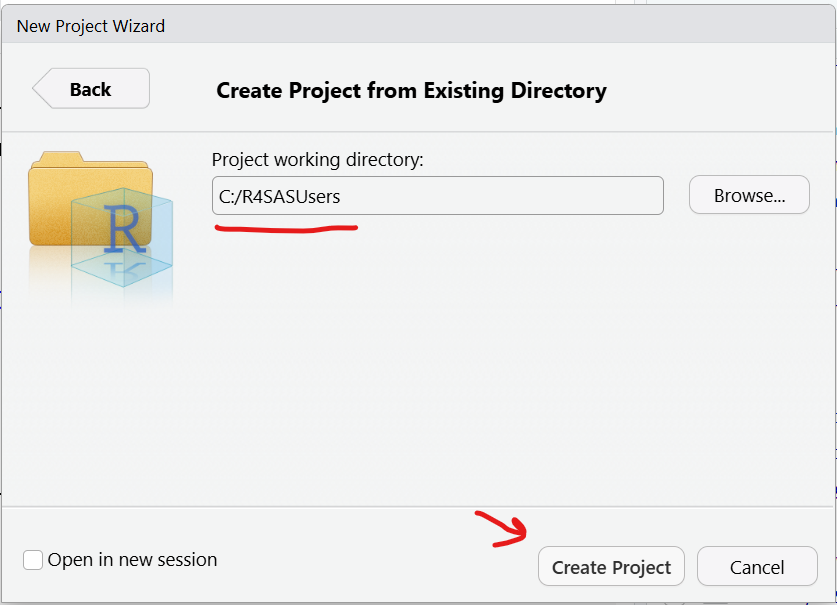

Your new RStudio project should look like this. Check the folder location at the top left of your window. Also check that this is the SAME folder shown in the "Files" tab at the bottom right window. In this "Files" window, you should see the files you copied over from what you downloaded from the "FilesForRProject" folder from the Google Drive [R4SASUsers_Oct2026](https://drive.google.com/drive/folders/1Nnb9pA7g7iRLg9o2yidV2MWMWoDTOcHV?usp=sharing) for this workshop.

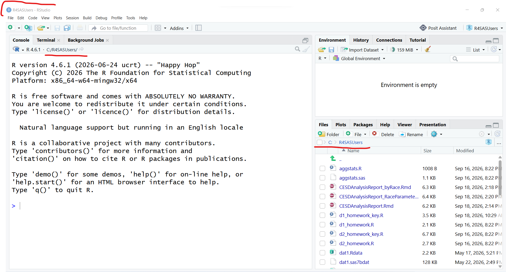


**CONGRATULATIONS** You should be good to go!

```{r echo=FALSE}
library(tidyverse)

```


---

\newpage

```{r echo=FALSE}
knitr::write_bib(x = c(.packages()), 
                 file = "packages.bib")
```

## References

::: {#refs}
:::

## Other Helpful Resources

[**Other Helpful Resources**](./additionalResources.html){target="_blank"}

