\thispagestyle{fancy}

```{r setup, include=FALSE}
knitr::opts_chunk$set(echo = TRUE,
                      error = TRUE,
                      message = FALSE,
                      warning = FALSE)
knitr::opts_chunk$set(
  comment = '', fig.width = 6, fig.height = 6
)

library(knitcitations)
library(gt)
```

## Session Objectives

1. Get Started with H.E.L.P. Dataset
2. Selecting and Exporting Data
    - A. Selecting Exporting Data (variables and subsets)
    - B. Exporting Data (variables and subsets)
3. Getting descriptive statistics
4. Getting started with visualization

---

## 0. Prework - Before You Begin

* R Packages Needed for this session:
    * [`tidyverse`](https://tidyverse.org/packages/) packages
        * [`readr`](https://readr.tidyverse.org/)
        * [`dplyr`](https://dplyr.tidyverse.org/)
        * [`ggplot2`](https://ggplot2.tidyverse.org/)
        * [`haven`](https://haven.tidyverse.org/)
    * [`ggtext`](https://wilkelab.org/ggtext/)

* R Code Files
    * [`module_d1_02.R`](module_d1_02.R)

* SAS Code Files
    * [`sascode_d1_02.sas`](sascode_d1_02.sas)

* R Data Files
    * [`help.Rdata`](help.Rdata)

* SAS Data Files
    * [`help.sas7bdat`](help.sas7bdat)
    
* Other Data Files - OPTIONAL
    * [`help.csv`](help.csv)
    * [`helpmkh.sav`](helpmkh.sav)

---

\newpage
## 1. Get Started with H.E.L.P. Dataset

For this course we will be working with the `HELP` dataset from this BOOK:

* ["SAS and R: Data Management, Statistical Analysis, and Graphics (second edition)" by Ken Kleinman and Nicholas J. Horton](https://nhorton.people.amherst.edu/sasr2/)
* [HELP Dataset](https://nhorton.people.amherst.edu/sasr2/datasets.php)
* This data was collected for the H.E.L.P. (Health Evaluation and Linkage to Primary Care) trial, [@samet2003]

### Options for importing/loading the HELP Dataset

The easiest option is to simply load the data in the `*.Rdata` native binary format, which is provided at the [HELP dataset link](https://nhorton.people.amherst.edu/sasr2/datasets.php).

```{r}
# OPTION 1: Load HELP dataset in .Rdata format
load("help.RData")
```

The dataset is also provided in the `*.sas7bdat` SAS data format. To load SAS formatted dataset, we can use the `read_sas()` function from the [`haven`](https://haven.tidyverse.org/) package.

```{r}
# OPTION 2: Load HELP dataset in .sas7bdat format
# Click File/Import Dataset/From SAS
library(haven)
helpmkh <- read_sas("help.sas7bdat", NULL)
```

Another way to import this SAS formatted dataset is to use the menu functions "File/Import Dataset/From SAS":

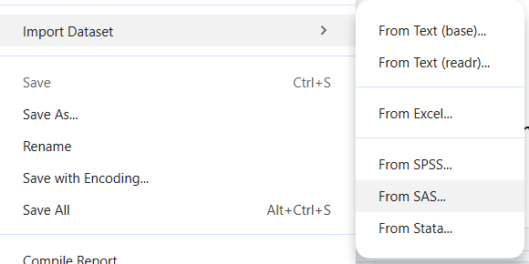

This opens a window that defaults to files located in the current project folder. From here we can select the `help.sas7bdat` file. We could go ahead and click the  "Import" button OR we can copy the R code generated in the Code Preview window, which is the code we have above.

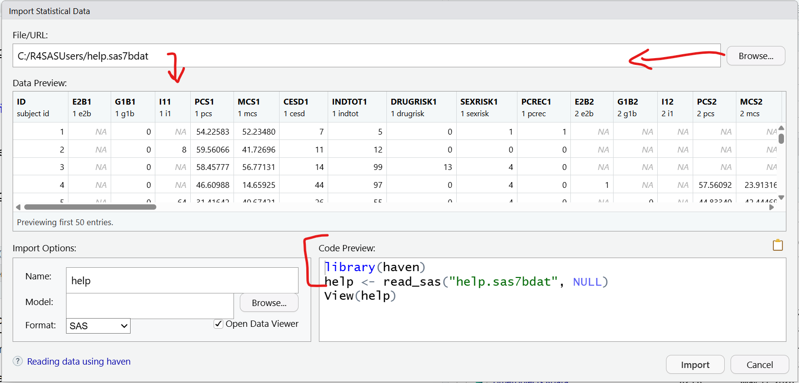

We can also use the [`haven`](https://haven.tidyverse.org/) package to use the `read_sav()` function to read in a SPSS formatted dataset as well.

```{r}
# OTHER FORMATS: Load HELP dataset from SPSS
# I edited this file to add the "codebook"
# variable and value labels included
library(haven)
helpmkh2 <- read_sav("helpmkh.sav")
```

The CSV (comma separated value) file format is also readily available for many datasets as well. We can use the `read_csv()` function from the `readr` package.

```{r}
# Read in CSV File - "Import Dataset/From Text (readr)"
library(readr)
help <- read_csv("help.csv")
```

After loading the dataset (`help.Rdata`), the dataset should now be visible in the Global Environment window at the top right:

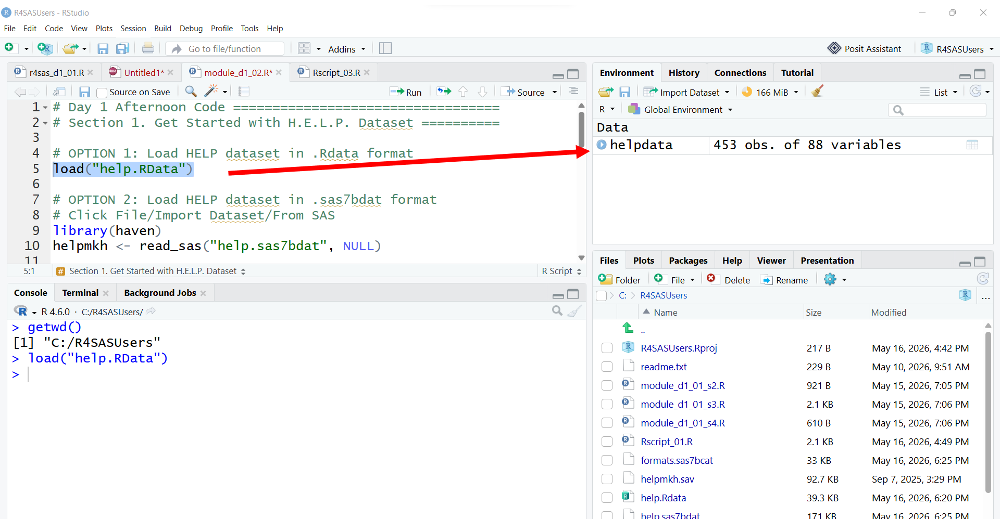

We can take a look at what is in this dataset, by clicking on the little blue circle with an arrow in it:

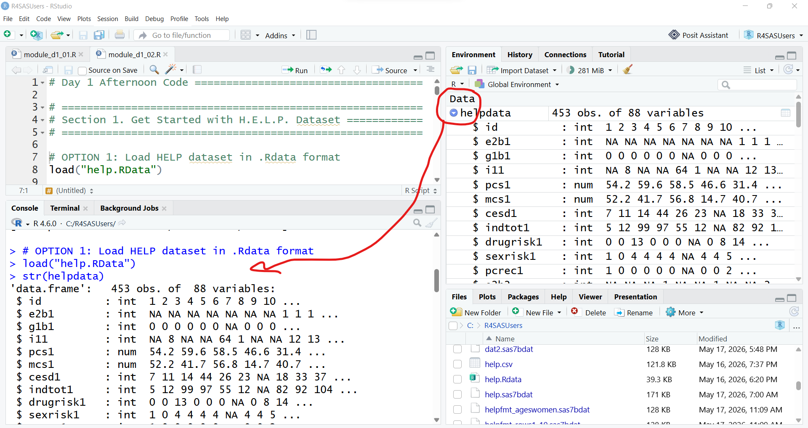

This provides the same info as running `str()` function Notice that we can see there are 453 observations (rows) and 88 variables (columns). We can also see that variables like `id`, `e2b1` are "int" (integers) and `pcs1` and `mcs1` are "num" (numeric) type variables. We can also see that `helpdata` is a `data.frame` object.

We can also get more information on this dataset using these functions.

```{r}
# find out what kind of object helpdata is
class(helpdata)
```


```{r}
# what are the dimension, rows -x- cols
dim(helpdata)
```


```{r}
# what are all of the names of the variables
names(helpdata)
```

::: {.callout-tip}
## Get variable names with and without quotes

There are times when you need quotes and times when you do not need quotes. The default `names()` function adds the quotes. If you would like to remove them you can use the `noquote()` function.
:::

```{r}
# put the output from names()
# into noquote() to remove the quotes
noquote(names(helpdata))
```


We can also "view" the dataset, by clicking on the little table icon at the far right. Clicking the icon runs the `View()` function which loads the viewer window.

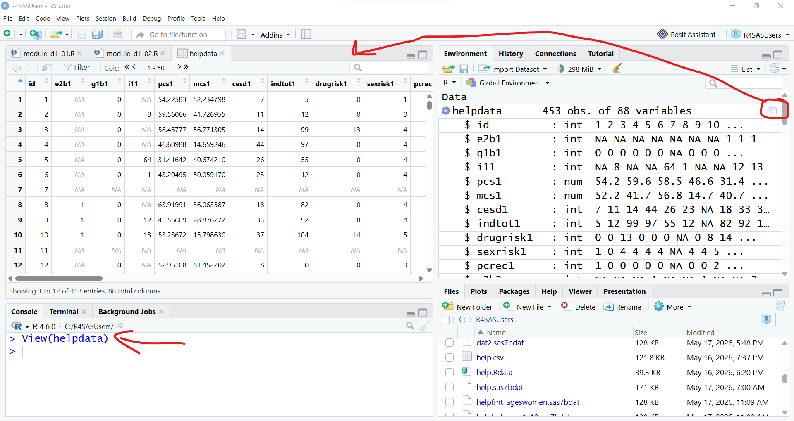

\newpage

### SAS Environment

Remember that we started with creating an RStudio Project for the folder `C:\R4SASUsers`. This process is similar to beginning your SAS compute session by setting a `LIBNAME` statement, so that SAS knows where your files are for your current project.

And I typically use the `DATA` step to make a copy of my data into the `WORK` library for the current computation session. The `WORK` library is like the `Global Environment` in R.

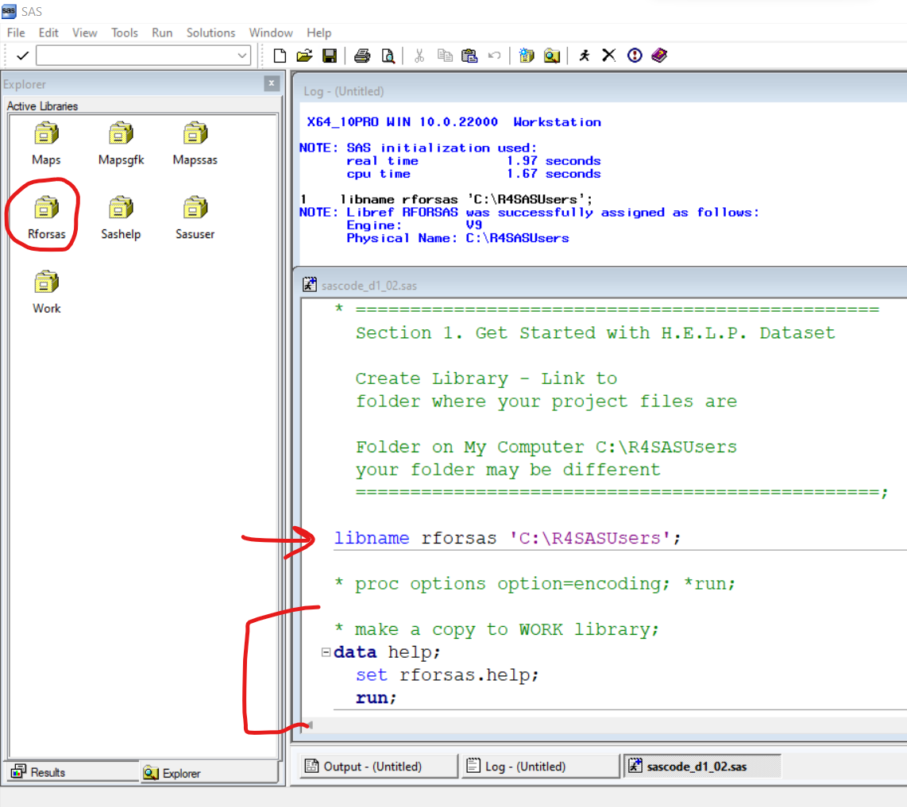

---

\newpage
## 2. Selecting and Exporting Data

Now that we have the HELP dataset loaded into our computing session, we can start working with the `helpdata` dataset object.

### 2A. Selecting Data (variables and subsets)
#### Selecting Variables or Columns - Base R approach

Using base R we can "select" variables out of the `helpdata` dataset using the `$` dollar sign. 

```{r}
# select the age variable
# from helpdata and show in Console
helpdata$age
```

If we don't want to simply see the result in the "Console" window, we can save the result into a new object to use later.

```{r}
# save as separate object
ages <- helpdata$age
```

#### `dplyr` approach using pipes

A better way is to use the `dplyr` package which uses a stepwise computing approach with the `magrittr` pipe `%>%`. What is a "pipe"?

In computer programming a "pipe" allows you to take the output from the preceding command and "send it" as input to the next command.

Let's take a look at the help page for the `select()` function from the `dplyr` package. 

Use `select(helpdata, age)` to select the `age` variable from the `helpdata` dataset.

```{r}
# tidyverse - dplyr Approach using select()
library(dplyr)

# using the dplyr::select() function
# the first argument is the dataset
# which is defined as .data = helpdata
# select the "age" variable from helpdata
select(helpdata, age)
```

However, we can use a pipe programming approach and re-write this line of code in 2 steps by listing the dataset first "and then" selecting the "age" variable from this dataset. Notice the `%>%` pipe operator at the end of the first line of code.

```r
helpdata %>%
  select(age)
```

The following 2 figures show that the `%>%` pipe operator takes the output `helpdata` and "sends it" into the `select()` function as the first argument. The second argument `age` which is the variable to be selected is then listed in the 2nd step of the code sequence after the `%>%` pipe operator.

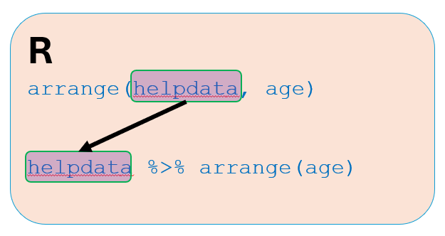

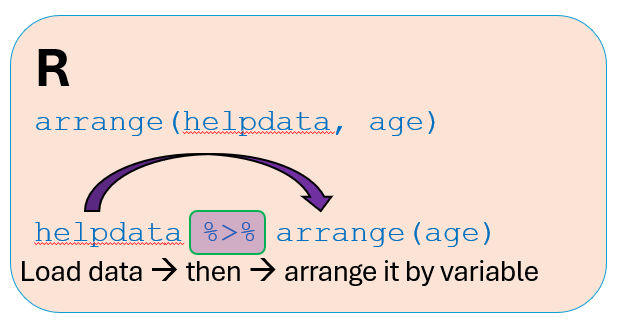

We can continue using the `%>%` pipe operator to put together multiple code steps in sequence where the output from the preceding function call is used as input to the next function call.

This block of code does the following:

1. load the `helpdata` dataset _"and then"_
2. selects the `age` variable from `helpdata` _"and then"_
3. shows the top 10 rows of ages using the `help()` function.

```{r}
helpdata %>%
  select(age) %>%
  head(10)        # show top 10 rows
```

We can also save the ages from the HELP dataset into another object called `ages2` but this time using the `dplyr` `select()` function.

```{r}
# save object
ages2 <- helpdata %>%
  select(age)
```

::: {.callout-note}
## Programming pipes`%>%` vs`|>`

For the purpose of this course, I will stick with the `magrittr` pipe `%>%`. However, there is also a "base R" pipe `|>`. For the most part these are interchangeable. however, there are a few differences discussed [in this blog post](https://tidyverse.org/blog/2023/04/base-vs-magrittr-pipe/).
:::

#### Base R versus `dplyr` approaches - differences in output

Both the "base R" and `dplyr` approaches will select the ages of the participants from the dataset. However, the resulting `ages` or `ages2` objects are slightly different. We can see how they look in the Global Environment window and by comparing the results from the `class()` function.

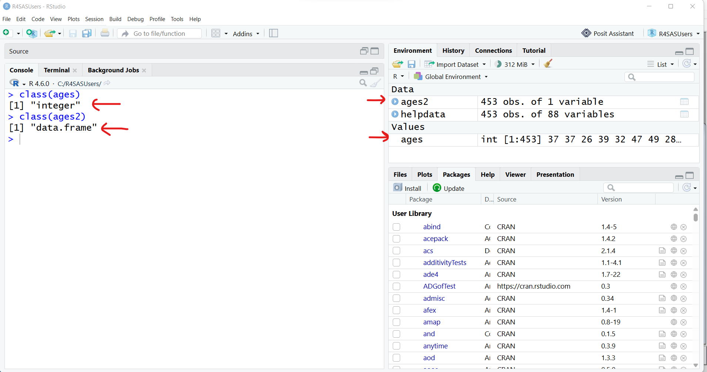

The "base R"approach results in a vector of integer numbers. The `dplyr` approach results in a simple `data.frame` object with 1 column - the `dplyr` approach preserves the original object type of `helpdata`.

```{r}
# base R approach result
class(ages)

# dplyr approach result
class(ages2)
```

We can always select more than one variable at at time by simply listing them separated by a comma. Notice that we do not need the quotes around the variable names.

```{r}
# select multiple variables
agecesd <- helpdata %>%
  select(age, cesd)
```

#### Selecting Rows - Base R

Another "Base R" method to select variables includes using indexes. For example select rows 1:10 and column 69 (which is `age`). We could also specify the `"age"` column name using "base R" syntax of `data[rownum, colnum]` or `data[rownum, colname]`.

```{r}
# Base R approach 
# pull out rows 1-10 and column 69 (which is age)
# dataset[row,column] index approach
helpdata[1:10, 69]

# another option, use variable name
helpdata[1:10, "age"]
```

\newpage

We could also filter out the males and only keep the rows of data for the females. The "Base R" approach gets a little tricky:

```{r}
# select women, get stats for age
# female coded as
#   0 for men
#   1 for women
# Use == for logical check of equality
# learn more
# help('==', package ="base")
ageswomen <- helpdata[helpdata$female == 1, "age"]
```

::: {.callout-important}
## The difference between `==` and `=`

R uses a single equal sign `=` for assigning a value to an argument in a function. For example, `plot(x=xdata, y=ydata)` to assign the variable to the x and y axes in a plot. But if we want to check to see if two objects are the same or match in a logical sense, we need to use `==` to see if two things match or not, `helpdata$female == 1`. This results in values of `TRUE` or `FALSE` which are reserved logical values in R. R then uses the values of `TRUE` or `FALSE` to parse which rows to keep or remove.
:::

#### Selecting Rows - `dplyr` Approach

As you've seen above the base R approach gets tricky quickly. This is why learning the `dplyr` approach is good - the code is much easier to understand. 

There are 2 main approaches for choosing a subset of rows out of a dataset using `dplyr` - either the [`slice()`](https://dplyr.tidyverse.org/reference/slice.html) or [`filter()`](https://dplyr.tidyverse.org/reference/filter.html) functions.

In the output below, again notice the difference between the "Base R" and `dplyr` approach output for `ageswomen` and `ageswomen2`.

```{r}
# dplyr approach ==========================================
# notice the output is different again
# get rows 1-10 and column 69 (which is age) 
helpdata %>%
  slice(1:10) %>%
  select(69)
```

\newpage

```{r}
# another option, use variable name
helpdata %>%
  slice(1:10) %>%
  select(age)
```


```{r}
# select women, get ages
ageswomen2 <- helpdata %>%
  filter(female == 1) %>%
  select(age)

class(ageswomen)
class(ageswomen2)
```

In summary, the `dplyr` programming approach using pipes `%>%` is easier to read and understand than the more complicated nested syntax of the Base R approach. The `dplyr` webpage has a nice article summarizing these differences at [https://dplyr.tidyverse.org/articles/base.html#one-table-verbs](https://dplyr.tidyverse.org/articles/base.html#one-table-verbs).

\newpage

### SAS Code for quick comparison

Here is the SAS code that also does the same data selection examples as above. 

* `firstobs` and `obs` options are used instead of the `dplyr` `slice()`function above
* `keep` is similar to the `dplyr` `select()` function
* for the logical filter step, we can use the SAS `where` statement

```default
data helpfmt_rows1_10;
    set helpfmt(firstobs=1 obs=10); /* keep rows 1-10*/
    keep age cesd;      /* Only keep age and cesd */
run;

* save ages for women;
data helpfmt_ageswomen;
    set helpfmt;
    where female = 1;   /* keep women */
    keep age;           /* Only keep age */
run;
```

\newpage

### 2B. Exporting Data (variables and subsets)

Now that we have created two new datasets, `agecesd` and `ageswomen2`, we could save these as R binary `*.RData` files for use in future computing sessions.

```{r}
# now that we have created some new datasets (data.frame)
# let's save agecesd and ageswomen2 as .Rdata files
save(agecesd, 
     file = "agecesd.Rdata")
save(ageswomen2, 
     file = "ageswomen2.Rdata")
```

Check your local file folder for this project - you should now have two new datafiles:

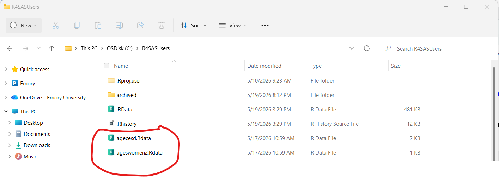

You could also save more than one object at a time into an R binary datafile - this can be very useful. These objects do NOT have to be datasets - they could be ANY kind of R object (models, graphic plots, custom functions and more).

```{r}
save(ages, ages2, ageswomen,
     file = "otherobjects.Rdata")
```

\newpage

Let's remove these objects and reload them. We can use the list `ls()` function to see all of the object currently loaded into the Global Environment for this R computation session. The `rm()` function removes the objects we specify.

```{r}
# let's remove these objects and reload them
# list objects in Global Environment
ls()
rm(ages, ages2, ageswomen, agecesd, ageswomen2)
ls()
```

Now load back `agecesd` from `agecesd.Rdata` and `ages`, `ages2`, `ageswomen` from `otherobjects.Rdata`.

```{r}
# load "agecesd.Rdata" a single data object
load("agecesd.Rdata")
ls()

# load "otherobjects.Rdata", multiple objects
load("otherobjects.Rdata")
ls()
```

\newpage

Suppose you want to keep everything (all of the objects) in your current Global Environment, you can also use `save.image()` which will save everything so you don't have to list every object individually.

```{r}
# if you want to save everything in your 
# global environment at the moment
save.image(file = "allobjects.Rdata")
```

Remove everything and then load it all back.

```{r}
# remove everything
rm(list = ls())
ls()

# load it back
load("allobjects.Rdata")
ls()
```

\newpage

### SAS Code for quick comparison

```default
* write these new datasets to your project folder ;

data rforsas.helpfmt_rows1_10;
    set work.helpfmt_rows1_10;
run;

data rforsas.helpfmt_ageswomen;
    set work.helpfmt_ageswomen;
run;

* Look at rforsas Library;

* look at WORK Library;

proc datasets lib=work nolist;
   delete helpfmt_rows1_10 helpfmt_ageswomen;
quit;

* read saved datasets back in to
  WORK library if wanted;

data work.helpfmt_ageswomen;
    set rforsas.helpfmt_ageswomen;
run;
```

---

\newpage
## 3. Getting descriptive statistics
### R - Quick `summary()` statistics

Besides the `class()` function for figuring out what an object's type is, the `summary()` function is another workhorse in the R language. 

::: {.callout-note}
## Generic functions

Both `class()` and `summary()` are what are called generic functions. A generic function "... invokes particular methods which depend on the class of the first argument." We will discuss this further tomorrow when we use the `summary()` function after running a regression model.
:::

For now, let's use the `summary()` function on a variable from a dataset. Technically this runs  `summary.default()`, see `help(summary.default)`.

Let's get some summary statistics for `age` from `helpdata`.

```{r}
# Get descriptive statistics with summary()
# get min, max, mean, median and quartiles
summary(helpdata$age)
```

This is a really helpful quick way to get summary statistics. I just wish the original programmers had also included the standard deviation in the output which would give me the parametric statistics: mean and sd as well as the non-parametric stats: median, 25th percentile and 75th percentile along with the min and max.

Here is the `dplyr` approach:

```{r}
helpdata %>%
  select(age) %>%
  summary()
```

\newpage

### SAS - summary statistics with `PROC UNIVARIATE`

There are many different ways to get summary descriptive statistics for variables in SAS. I often use `PROC UNIVARIATE` for this purpose.

```default
* get descriptive statistics of age;
proc univariate data=help plots;
  var age;
  run;
```

### R - More individual functions for descriptive stats

Let's also get the standard deviation using `sd()`

```{r}
# base R
sd(helpdata$age)
```


```{r}
# dplyr pipe approach
helpdata %>%
  select(age) %>%
  sd()
```

OOPS This throws and error. Let's figure out why.

```{r}
# the sd() function is expecting
# a vector type variable not a data.frame
# what is the result after the select() step

aa <- helpdata %>%
  select(age)
class(aa)
```

See `help(sd)` to see that the `sd()` function is expecting a numeric vector as input and NOT a data.frame. So we need to either convert the output using `unlist()` after `select()` or use a different selection function like `pull()` from `dplyr`. _NOTE: A `data.frame`is a special type of `list` class object in R._

```{r}
# use the unlist() function to convert it to a vector
helpdata %>%
  select(age) %>%
  unlist() %>%
  sd()
```

The `dplyr` package also has the `pull()` function which results in a vector and NOT a `data.frame` output object. 

```{r}
# the dplyr package also has
# the pull() function which results in 
# a vector as well
helpdata %>%
  pull(age) %>%
  sd()
```

::: callout-note
## `select()` versus `pull()` in `dplyr` package

Take a moment and compare the output "Value" produced from the `pull()` versus `select()` functions - look at the "help" window for both functions and scroll down to the "Value" section of the "help" page.

Notice that the output from `pull()` is a vector class type and the output from `select()` is the same class type as the `.data` argument.

### Output from `pull()`

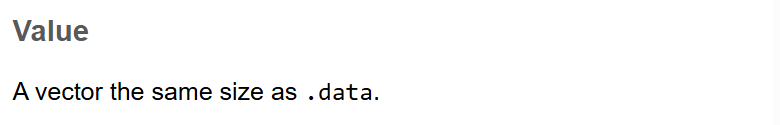

### Output from `select()`

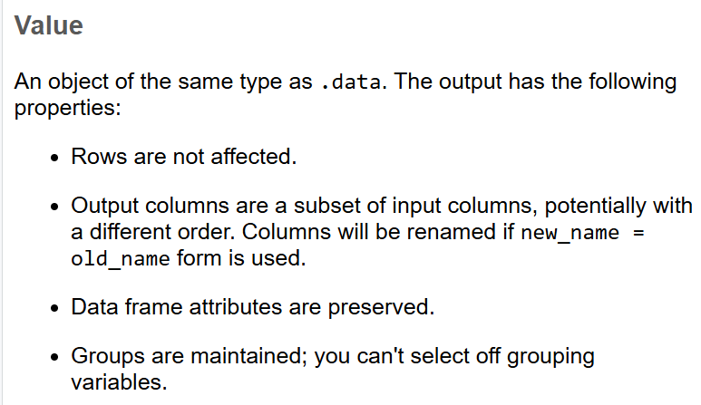
:::


What if we have missing data indicated by `NA` in our dataset?

Let's generate a numeric vector with a missing value and then see what happens with these functions.

```{r}
# vector of numeric values
x <- c(1,2,3,4,5,NA)
x

# get summary statistics
summary(x)
```

This worked, but notice the summary output clearly shows we have 1 `NA` value.

What about the `sd()` function?

```{r}
# try the sd() function
sd(x)
```

The value returned was `NA`. This can be frustrating, but there is a method to the madness. Technically, since there is a value missing, we have to explicitly tell the `sd()` function what we want to do - do we want to remove the missing values and then compute the standard deviation. We can do that by setting the argument for `na.rm` to `TRUE.`

It is also good that we get `NA` in our output since this tells us we have missing data in our dataset for this variable which prompts us to make decisions on how to handle or adjust for the missing data BEFORE completing the analysis or computations. 

```{r}
# now tell sd what to do if there are missing values
sd(x, na.rm=TRUE)

# dplyr approach
x %>%
  sd(na.rm=TRUE)
```

It is a good idea to just get in the habit of adding `na.rm=TRUE` to these functions to make sure you are providing explicit instructions on how to handle the missing data.

\newpage

### R - parametric and non-parametric stats

Base R code adding `na.rm=TRUE`:

```{r}
# adjust for missing values
# parametric stats
mean(helpdata$age, na.rm=TRUE)
sd(helpdata$age, na.rm=TRUE)

# get non-parametric statistics
min(helpdata$age, na.rm=TRUE)
max(helpdata$age, na.rm=TRUE)
median(helpdata$age, na.rm=TRUE)
quantile(helpdata$age, probs = 0.25, na.rm=TRUE)
quantile(helpdata$age, probs = 0.75, na.rm=TRUE)
```

::: {.callout-warning}
## Default settings!

NOTE: Pay attention to default settings! For the `quantile()` function to compute percentiles, be sure to check the default settings for this function. There are 9 possible algorithms you can choose from. The default is type=7. This may not match other software packages default algorithms. For large sample sizes these differences should be minor. But for smaller sample sizes, these algorithms from computing percentiles may/will be different. 
:::

Let's look at the help window for `quantile()`.

```r
help(quantile, package = "stats")
```

Quantile Help Windows

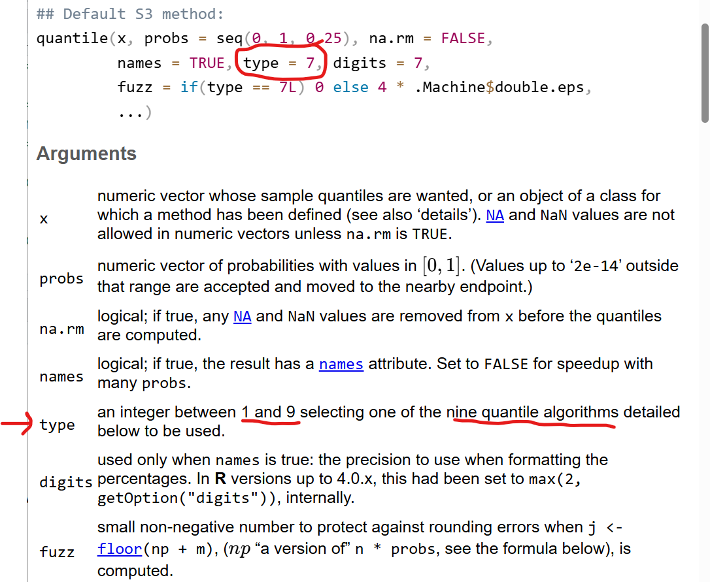

\newpage

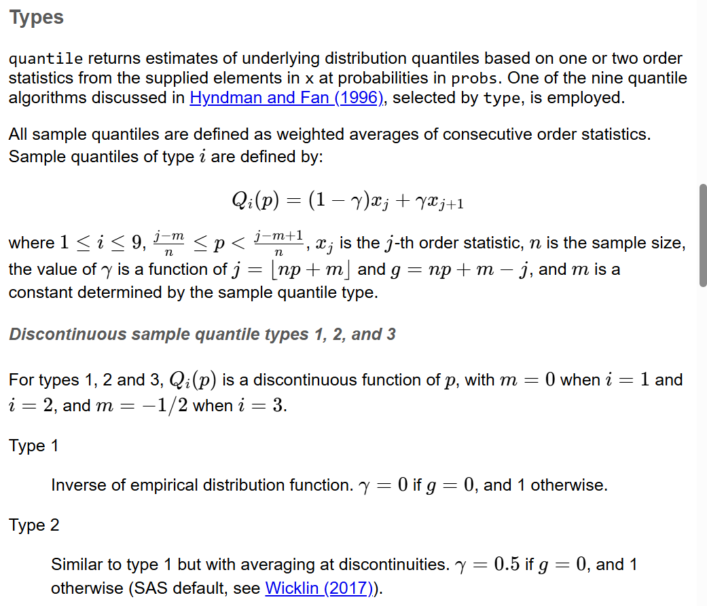

\newpage

Compare the output differences between using algorithm `type=7` to `type=9`:

```{r}
# get 25th, 50th, 75th percentiles
# use default type=7
quantile(helpdata$age, 
         probs = c(0.25, 0.50, 0.75),
         na.rm=TRUE)

# compare to type=9
quantile(helpdata$age, 
         probs = c(0.25, 0.50, 0.75),
         type=9,
         na.rm=TRUE)
```

\newpage

### SAS - parametric and non-parametric stats

To produce neatly formatted tables of summary statistics, I also like using `PROC MEANS` in SAS.

```default
* another approach with proc means
  - get parametric statistics;
proc means data=help n min max mean std;
  var age;
  run;

* another approach with proc means
  - get non-parametric statistics;
proc means data=help n q1 median q3;
  var age;
  run;

* There are 5 options for quantile
  calculation in SAS, see SAS help for
  "Quantile and Related Statistics"
  QNTLDEF=5 is the default
  compare to QNTLDEF=4;

proc means data=help q1 median q3 QNTLDEF=4;
  var age;
  run;
```

\newpage

### R - `dplyr` approach for custom statistics

`dplyr` approach to show multiple custom statistics all in the same output.

```{r}
# create custom output
helpdata %>%
  summarise(
    age_n = n(),
    meanage = mean(age, na.rm=TRUE),
    sdage = sd(age, na.rm=TRUE),
    medage = median(age, na.rm=TRUE),
    q25age = quantile(age, 
                      probs = 0.25,
                      na.rm=TRUE),
    q75age = quantile(age, 
                      probs = 0.75,
                      na.rm=TRUE),
    minage = min(age, na.rm=TRUE),
    maxage = max(age, na.rm=TRUE)
  )
```

\newpage

Let's leverage other functions in `dplyr` to help. Let's get the custom statistics for the women only by adding `filter(female == 1)`. 

```{r}
# get age stats for women only
helpdata %>%
  filter(female == 1) %>%
  summarise(
    age_n = n(),
    meanage = mean(age, na.rm=TRUE),
    sdage = sd(age, na.rm=TRUE),
    medage = median(age, na.rm=TRUE),
    q25age = quantile(age, 
                      probs = 0.25,
                      na.rm=TRUE),
    q75age = quantile(age, 
                      probs = 0.75,
                      na.rm=TRUE),
    minage = min(age, na.rm=TRUE),
    maxage = max(age, na.rm=TRUE)
  )
```

\newpage

We can also use the `group_by` function to get stratified output by group as well. Let's look at these statistics for each of the 4 race/ethnicity groups:

```{r}
# get age stats by racegrp
helpdata %>%
  group_by(racegrp) %>%
  summarise(
    age_n = n(),
    meanage = mean(age, na.rm=TRUE),
    sdage = sd(age, na.rm=TRUE),
    medage = median(age, na.rm=TRUE),
    q25age = quantile(age, 
                      probs = 0.25,
                      na.rm=TRUE),
    q75age = quantile(age, 
                      probs = 0.75,
                      na.rm=TRUE),
    minage = min(age, na.rm=TRUE),
    maxage = max(age, na.rm=TRUE)
  )
```

\newpage

### SAS - Custom stats tables for filtered subsets and stratified by group

To get statistics for a subset of the data, we can use the `WHERE` statement in SAS. To get stratifed output, we can also used the `CLASS` statement.

```default
* Get stats for a subset
  ages and cesd for women only;

proc means data=help;
  where female = 1;
  var age;
  run;

* Get stats for a subset
  ages and cesd BY racegrp;

proc means data=help;
  class racegrp;
  var age;
  run;
```
\newpage

### R - Sorting and displaying data

Let's combine multiple `dplyr` functions to wrangle our data to pull out specific parts of our dataset.

For example lets:

1. just look at the women
2. look at only the subject `id` and `cesd` scores
3. sort the data by `age`

```{r}
# select IDs and cesd scores for women
# sort by age
helpdata %>%
  filter(female == 1) %>%
  select(id, cesd) %>%
  arrange(age)
```

Oops we got an error - why didn't this work?

We selected `id` and `cesd` in step 2 so when we got ready to sort the data in step 3 we had already removed `age`. We need to change the order of these steps.

I've also added a 4th step to only show the `head()` or top rows for the 5 youngest women in the output below.

```{r}
# select women
# sort by age
# show IDs, ages and cesd scores for 5 youngest women
helpdata %>%
  filter(female == 1) %>%
  arrange(age) %>%
  select(id, age, cesd) %>%
  head(5)
```

What if we want to see the `id` and `cesd` scores for the 5 oldest women. We could sort the data in descending order by age OR we could keep the ascending order and look at the bottom or `tail()` part of the dataset. The results of these 2 options is slightly different, but the result is for the same 5 `id`'s.

```{r}
# show IDs, ages and cesd scores for 5 oldest women
# option 1
helpdata %>%
  filter(female == 1) %>%
  arrange(desc(age)) %>%
  select(id, age, cesd) %>%
  head(5)
```


```{r}
# option 2 - same results slightly different order
helpdata %>%
  filter(female == 1) %>%
  arrange(age) %>%
  select(id, age, cesd) %>%
  tail(5)
```

\newpage

### SAS - Sorting and displaying data

Here is the SAS code to do the same sorting and displaying of the selected variables for the women in `helpdata`.

```default
* sorting and displaying data =========================;
* sort data by age for women;

proc sort data=help out=womensortage;
   by age;
   where female = 1;
run;

* show ids and cesd scores
  for 5 youngest women;

proc print data=womensortage(obs=5);
  var id age cesd;
  run;

* show ids and cesd scores
  for 5 oldest women
  have to know number of rows=107
  set firstobs=102
  set last observation to obs=107;

proc print data=womensortage(firstobs=102 obs=107);
  var id age cesd;
  run;

* or sort descending and reuse code above;

proc sort data=help out=womensortdage;
   by descending age;
   where female = 1;
run;

proc print data=womensortdage(obs=5);
  var id age cesd;
  run;
```
\newpage

### R - Table summaries of categorical variables and associated tests

Another workhorse function in R is the `table()` function. Let's look at the breakdown of gender in this dataset:

```{r}
# get frequencies and percents
# table of gender, show any missing values
# base R
table(helpdata$female, 
      useNA = "ifany")

# dplyr approach
helpdata %>%
  select(female) %>%
  table(useNA = "ifany")
```

::: {.callout-tip}
## Handling missing values for categorical data

Similar to using `na.rm=TRUE` for the statistical functions above, we can/should also tell `table()` what we want to do with the missing values. By adding `useNA = "ifany"` we will also get a count of how many missing values there are for this categorical variable.
:::

```{r}
# table of categorical data with NAs
fruit <- c("apple","apple","apple",
           "grape", NA, "grape")
table(fruit)
table(fruit, useNA = "ifany")
```

The `e2b` variable in the HELP dataset comes from a branching logic question about whether or not the participant had entered detox and, if so, how many times they have been in detox. So, this variable has missing data for the people who did NOT enter detox. Let's look at the output with and without a listing of the missing `NA`'s.

```{r}
# table summary without a list of the missing NAs
table(helpdata$e2b)
```

```{r}
# table summary with a list of the missing NAs
table(helpdata$e2b, useNA = "ifany")
```


Two-way tables:

```{r}
# table of racegrp by gender
# base R
table(helpdata$racegrp,
      helpdata$female, 
      useNA = "ifany")

# dplyr
helpdata %>%
  select(racegrp, female) %>%
  table(useNA = "ifany")
```

\newpage

### R - Create a "factor" type variable with labels for gender

It can get annoying trying to remember what the various numeric codes are for each category. To combine numeric coding with value labels, we should create a "factor-type" variable. We can then use these to make easier to read and present tables for ourselves and the readers of our results.

```{r}
# add value labels to female
# and make it a "factor"
# Base R option
helpdata$female.f <- 
  factor(helpdata$female,
         levels = c(0, 1),
         labels = c("male", "female"))

# dplyr options with mutate
helpdata <- helpdata %>%
  mutate(
    gender.f = factor(female,
                      levels = c(0, 1),
                      labels = c("male", "female")))
```

Two-way table with labels added - use `gender.f`.

```{r}
# dplyr
helpdata %>%
  select(racegrp, gender.f) %>%
  table(useNA = "ifany")
```


\newpage

### R - A Better Formatted Table with `gmodels` package

A function I really like for making table is the `CrossTable()` function from the `gmodels` package. You can use this function to make tables that resemble the output you expect from `PROC FREQ` from SAS.

In the code shown below, I'm asking to display the:

* raw counts
* expected counts
* and column %'s
* row %, total % and chisquare proportion are turn off, set to `FALSE`
* I'm also asking to run the `chisq` test and `fisher`'s exact tests
* and the output should be formatted like SAS

Notice that I am using the `gender.f` factor type variable with better labels.

```{r}
# make table with gmodels package
# and CrossTable() function
# show expected counts
#      percents within columns
#      chi-square test
#      fisher's exact test

library(gmodels)
gmodels::CrossTable(helpdata$racegrp, 
                    helpdata$gender.f,
                    expected=TRUE,
                    prop.r=FALSE,
                    prop.t=FALSE,
                    prop.chisq=FALSE,
                    chisq=TRUE,
                    fisher=TRUE,
                    format = "SAS")
```

\newpage

### Another nicely formatted table with `gtsummary` package

The [`gtsummary` package](https://www.danieldsjoberg.com/gtsummary/) provides the `tbl_cross()` function which make nicely formatted tables of summary statistics. Here is an example table for the 4 race/ethnicity groups by gender.

The steps and lines of code below do the following:

1. within the table:
    - put `racegrp` in rows
    - put `gender.f` in columns
    - only show the % within each column
2. for the overall table, make the row and column labels **bold** text
3. add the p-values for the statistical test (which defaults to the `chisquare.test()`)

```{r}
#| label: tbl-reg
#| echo: true
#| tbl-pos: H

# using gtsummary package
# and tbl_cross() function
library(gtsummary)
helpdata %>%
  tbl_cross(row = racegrp, 
            col = gender.f,
            percent = "column") %>%
  bold_labels() %>%
  add_p()
```

\newpage

We could also get the Fisher's exact test by changing the default setting in the `add_p()` function.

```{r}
#| label: tbl-reg2
#| echo: true
#| tbl-pos: H

# run fisher's exact test
helpdata %>%
  tbl_cross(row = racegrp, 
            col = gender.f,
            percent = "column") %>%
  bold_labels() %>%
  add_p(test = "fisher.test")
```

\newpage

And here are a few more customization's that can be helpful. Changing the decimal precision.

```{r}
#| label: tbl-reg3
#| echo: true
#| tbl-pos: H

# show p-value to 3 digits
# show counts to 0 decimals
# show columns percent to 2 decimal digits
helpdata %>%
  tbl_cross(row = racegrp, 
            col = gender.f,
            percent = "column",
            digits = c(0, 2)) %>%
  bold_labels() %>%
  add_p(test = "fisher.test",
        pvalue_fun = label_style_pvalue(digits = 3))
```

\newpage

Adding better labels and a title for the table.

```{r}
#| label: tbl-reg4
#| echo: true
#| tbl-pos: H
#| tbl-cap: "Table Race by Gender"

# add better labels
# add caption title
helpdata %>%
  tbl_cross(row = racegrp, 
            col = gender.f,
            percent = "column",
            digits = c(0, 2),
            label = list(
              racegrp = "Race",
              gender.f= "Gender"
            )) %>%
  bold_labels() %>%
  add_p(test = "fisher.test",
        pvalue_fun = label_style_pvalue(digits = 3)) %>%
  modify_caption("**Table Race by Gender**")
```

\newpage

Back to default chi-square test results:

```{r}
#| label: tbl-reg5
#| echo: true
#| tbl-pos: H
#| tbl-cap: "Table Race by Gender"

# and with chi-square test results
helpdata %>%
  tbl_cross(row = racegrp, 
            col = gender.f,
            percent = "column",
            digits = c(0, 2),
            label = list(
              racegrp = "Race",
              gender.f= "Gender"
            )) %>%
  bold_labels() %>%
  add_p(pvalue_fun = label_style_pvalue(digits = 3)) %>%
  modify_caption("**Table Race by Gender**")

```

\newpage

### SAS - Table summaries of categorical variables and associated tests

For getting summary tables for categorical data, `PROC FREQ` works well in SAS and also is used for performing chi-square and Fisher's exact tests.

```default
* get frequency tables;

proc freq data=helpfmt;
  tables female racegrp;
  run;

* get race by gender
  chi-square test 
  and fisher's exact tests
  show column percents, counts, 
  and expected counts;

proc freq data=helpfmt;
  table racegrp*female / chisq fisher expected norow nopercent;
  run;
```

---

\newpage
## 4. Getting started with visualization

The base R `graphics` package is actually very powerful in its own right. There are some amazing ["artwork" graphics](https://blog.djnavarro.net/posts/2023-03-31_generative-art-with-grid/) you can do with R graphics.

That said, for this course we will focus on learning `ggplot2` which has been around for more than [15-20 years](https://cran.r-project.org/src/contrib/Archive/ggplot2/)!!

`ggplot2` is so popular it has almost become the defacto standard for R graphics. Many hundreds of other packages have been developed that are compatible or leverage the `ggplot2` syntax and functions. As of 05/20/2026 at 4:15 pm EDT, there are 256 packages alone on [CRAN](https://cran.r-project.org/web/packages/available_packages_by_name.html#available-packages-G) starting with `gg` and there are many more R packages that do not have `gg` in the package name that are still compatible.

### Handy Graphics Resources for R

Here are some good places to start to get help and get inspired for making graphics, figures and art in R.

* [Additional Resources for this Course](https://melindahiggins2000.github.io/StatisticalHorizons_R4SASUsers/additionalResources.html#r-graphics)
* [Best Data Visualization Packages](https://r-graph-gallery.com/best-dataviz-packages.html)
* [Data Visualization with Base R](https://r-graph-gallery.com/base-R.html)

### Basics for `ggplot2`

The `gg` stands for the "grammar of graphics". The idea is to build a graphic using the data, layers of aesthetics, annotations, statistics, graphic objects and more.

Let's build a scatterplot of the `mcs` with `cesd` from the `helpdata` dataset. We'll color the points by gender and add some informative labels, title and caption as well. We'll also add "best fit" linear regression models for the association between the `mcs` and `cesd` by gender.

\newpage

1. Initialize `ggplot()` for the dataset
    - This opens a graphics window.

```{r}
library(ggplot2)

# initialize ggplot() for the dataset
ggplot(data = helpdata)
```

\newpage

2. Define the aesthetics for the x and y axes.
    - this now adds axes scaled for each variable on each axis and lays out a grid.

```{r}
ggplot(data = helpdata,
       aes(x = mcs,
           y = cesd))
```

\newpage

3. How to "see" the data?
    - We need to specify a "geom" which is a geometric object. Since we're doing a scatterplot, we will use `geom_point()` to show the data using points or dots.
    
::: {.callout-note}
## Adding Layers with `+`

In `ggplot2` we build a graphical figure adding layers of "geoms" and other attributes like labels using `+` plus operator.
:::

```{r}
# scatterplot of mcs and cesd
ggplot(data = helpdata,
       aes(x = mcs,
           y = cesd)) +
  geom_point()
```

\newpage

4. Add color for the points using `gender.f`

```{r}
# color by gender
ggplot(data = helpdata,
       aes(x = mcs,
           y = cesd,
           color = gender.f)) +
  geom_point()
```

\newpage

5. Add better labels using `labs()`

::: {.callout-note}
## A little text wrangling

In the long caption I added below, I inserted `\n` to add a line break. Learn more at:

* [https://r-graph-gallery.com/289-control-ggplot2-title.html](https://r-graph-gallery.com/289-control-ggplot2-title.html)
* [https://ggplot2-book.org/annotations.html](https://ggplot2-book.org/annotations.html)
:::

::: {.callout-tip}
## Aligning aesthetic with legend title

Since we used `gender.f` for the aesthetic for `color`, when we want to change the label for the legend title we use `color` to assign the custom legend for that aesthetic - otherwise the legend title defaults to the variable name "gender.f".
:::

```{r}
# add title, footnote, and better axis labels
# color by gender
# update legend title
# \n inserts line break in long caption
ggplot(data = helpdata,
       aes(x = mcs,
           y = cesd,
           color = gender.f)) +
  geom_point() +
  labs(
    title = "CESD Scores by MCS Scores",
    x = "CESD Scores",
    y = "MCS Scores",
    color = "Gender",
    caption = "CESD = Center for Epidemiological Studies-Depression \nand MCS = Mental Component Scale for SF36 Quality of Life"
  )
```


\newpage

6. Add "best fit" linear regression model lines to the plot by gender by adding the layer `geom_smooth(method = "lm")`.

```{r}
# add best fit lines by gender
ggplot(data = helpdata,
       aes(x = mcs,
           y = cesd,
           color = gender.f)) +
  geom_point() +
  geom_smooth(method = "lm") +
  labs(
    title = "CESD Scores by MCS Scores",
    subtitle = "Models by Gender",
    x = "CESD Scores",
    y = "MCS Scores",
    color = "Gender",
    caption = "CESD = Center for Epidemiological Studies-Depression \nand MCS = Mental Component Scale for SF36 Quality of Life"
  )
```

\newpage

### SAS - Visualizations with `PROC SGPLOT`

`PROC SGPLOT` is also really useful for making graphics visualizations in SAS. Here is the SAS code to make plots similar to what we did above.

```default
* scatterplot of mcs and cesd;
proc sgplot data=helpfmt;
  scatter x=mcs y=cesd;
run;

* color by gender;
proc sgplot data=helpfmt;
  scatter x=mcs y=cesd / group=female;
run;

* add best fit lines by group;
proc sgplot data=helpfmt;
  reg x=mcs y=cesd / group=female;
run;

* add title, footnotes, 
  update xaxis and yaxis labels
  and legend title
  add confidence bands for best fit lines;

TITLE1 "CESD Scores by MCS Scores";
FOOTNOTE1 "CESD = Center for Epidemiological Studies-Depression";
FOOTNOTE2 "MCS = Mental Component Scale for SF36 Quality of Life";

proc sgplot data=helpfmt;
  reg x=mcs y=cesd / clm group=female;
  xaxis label="MCS Scores";
  yaxis label="CESD Scores";
  keylegend / title="Gender";
run;

TITLE; FOOTNOTE; /* Clears the titles and footnotes */
```

\newpage

### OPTIONAL PLOT EXAMPLE

For the plot example below, we need to first gather some summary statistics and save them into a new dataset object. We will build the plot below using the original dataset `ToothGrowth` (which is a built-in dataset) AND the `tg.summary` data object.

We will be building this error bar plot showing the means +- standard deviations of tooth lengths over 3 dose levels of Vitamin C from either Vitamin C (VC) supplements or orange juice(OJ). And we're going to also show the data points overlaid on top of the errorbars.

We will build the plot as follows:

1. data source = `ToothGrowth`
2. aesthetics x=`dose` and y=`len`
3. to show connections between the means use `geom_line()`
4. to make the points for the means use`geom_point()`
5. to make the errorbars (+/-) standard deviations use `geom_errorbar()`
6. to overlay the original individual data points use `geom_jitter()` - within this geom I have added aesthetics to customize `color`, `shape` and `fill` for the points according to the supplement type (VC vs OJ)
7. I have also used the `shape_xxxx_manual()` functions to set the specific
    - point "shapes", see `help(par, package = "graphics")` and scroll through the options for "pch" also  see `help(points, package = "graphics")`.
    - outline "color" for which I used two of the built-in colors, see a full list by running `colors()`
    - point "fill" colors for which I used HEXCOLOR codes, you can pretty much use any hexadecimal code for color, see example codes at [https://htmlcolorcodes.com/](https://htmlcolorcodes.com/)
8. I also added a `facet_wrap()` to create a 2 panel plot for each supplement
9. I added custom labels
    - most of these we've used in the above examples
    - for the caption I actually included some "markdown" syntax to allow for more custom text formatting - to use these formats I had to first load the `ggtext` package, and add the `theme(plot.caption = element_markdown())`
    - to customize the "legend" title, I set `color=`, `shape=` and `fill=` to the same text since all of these aesthetics are aligned with the same variable `supp` for the supplement type.

\newpage

```{r}
# OPTIONAL PLOT EXAMPLE 
# first get summary stats
# build error bar using stats
# means +/- SD for error bars
#
# use layers and multiple data sources
# to make lines plus points
# and add custom shapes
# custom color outlines and fills
# by groups
# 
# add ggtext package to enable markdown
# for formatting text in the caption
# see theme(plot.caption = ) below
library(ggtext)

# use ToothGrowth builtin dataset
# get summary stats
tg.summary <- ToothGrowth %>%
  group_by(dose) %>%
  summarise(
    sd = sd(len, na.rm = TRUE),
    len = mean(len)
  )
tg.summary
```

\newpage

```{r}
# Combine with jitter points
ggplot(ToothGrowth, 
       aes(x=dose, 
           y=len)) +
  geom_line(data = tg.summary,
            aes(group = 1),
            linewidth = 1.5) + 
  geom_point(data = tg.summary,
             size = 2) + 
  geom_errorbar(aes(ymin = len-sd, ymax = len+sd),
                width = 0.2,
                linewidth = 1.5,
                data = tg.summary) + 
  geom_jitter(position = position_jitter(0.2), 
              aes(color = supp, 
                  shape = supp,
                  fill = supp),
              size = 3) + 
  scale_shape_manual(values = c(21, 24)) +
  scale_color_manual(values = c("black",
                                "blue")) +
  scale_fill_manual(values = c("#cf34eb",
                               "#34eb4c")) +
  facet_wrap(vars(supp)) +
  labs(x = "Dose (mg/day)",
       y = "Length",
       title = "Guinea Pig Incisor Odontoblast Growth by Vitamin C Dose",
       subtitle = "Means +/- SD",
       caption = "Citation: Crampton, E. W. (1947). The growth of the odontoblast of the incisor teeth <br>as a criterion of vitamin C intake of the guinea pig. <br>*The Journal of Nutrition*, **33**_(5)_, 491–504. <br>*doi:10.1093/jn/33.5.491*.",
       color = "Supplement Type",
       shape = "Supplement Type",
       fill = "Supplement Type") +
  theme(plot.caption = element_markdown())
```

---

\newpage

```{r echo=FALSE}
knitr::write_bib(x = c(.packages()), 
                 file = "packages.bib")
```

## R and SAS Code For This Module

* [`module_d1_02.R`](module_d1_02.R)
* [`sascode_d1_02.sas`](sascode_d1_02.sas)

## References

::: {#refs}
:::

## Other Helpful Resources

[**Other Helpful Resources**](./additionalResources.html){target="_blank"}

