\thispagestyle{fancy}

```{r setup, include=FALSE}
knitr::opts_chunk$set(echo = TRUE,
                      error = TRUE,
                      message = FALSE,
                      warning = FALSE)
knitr::opts_chunk$set(
  comment = '', fig.width = 6, fig.height = 6
)

# packages needed for this session

library(dplyr)
library(effectsize)
library(gmodels)
library(gtsummary)
library(effects)
library(emmeans)
library(broom)
library(tidyr)
library(gt)

# load data
load("help.Rdata")
```

## Session Objectives

1. Statistical Tests and Models
    - A. T-test and Bartlett's test of equal variance
    - B. Effectsizes - Cohen's d
    - C. Wilcox (Mann Whitney) Test
    - D. Chi-square test
    - E. ANOVA (Analysis of Variance)
    - F. Linear Regression
    - G. Logistic Regression
2. Merging Datasets
    - A. joins (add columns)
    - B. concatenate (bind rows)
3. Restructuring Datasets
    - A. Restructure from WIDE to LONG
    - B. Restructure from LONG to WIDE

---

\newpage

## 0. Prework - Before You Begin

* R Packages Needed for this session:

    * [`dplyr`](https://dplyr.tidyverse.org/)
    * [`effectsize`](https://easystats.github.io/effectsize/)
        - Note: `effectsize` is also part of a suite of packages called [`easystats`](https://easystats.github.io/easystats/).
    * [`gmodels`](https://cran.r-project.org/web/packages/gmodels/index.html)
    * [`gtsummary`](https://www.danieldsjoberg.com/gtsummary/)
    * [`effects`](https://cran.r-project.org/web/packages/effects/index.html)
    * [`emmeans`](https://rvlenth.github.io/emmeans/)
    * [`broom`](https://broom.tidymodels.org/)
    * [`tidyr`](https://tidyr.tidyverse.org/)
    
* R Code Files
    * [`module_d2_01.R`](module_d2_01.R)

* SAS Code Files
    * [`sascode_d2_01.sas`](sascode_d2_01.sas)

* R Data Files
    * [`help.Rdata`](help.Rdata)
    * [`dat1.Rdata`](dat1.Rdata)
    * [`dat2.Rdata`](dat2.Rdata)
    * [`treat1.Rdata`](treat1.Rdata)
    * [`treat2.Rdata`](treat2.Rdata)

* SAS Data Files
    * [`help.sas7bdat`](help.sas7bdat)
    * [`dat1.sas7bdat`](dat1.sas7bdat)
    * [`dat2.sas7bdat`](dat2.sas7bdat)
    * [`treat1.sas7bdat`](treat1.sas7bdat)
    * [`treat2.sas7bdat`](treat2.sas7bdat) 

---

\newpage

## Notes from DAY 1 and Homework Review

* Saving Plots [`saveplots.R`](saveplots.R)
* Homework 1 Answer Key [`d1_homework_key.R`](d1_homework_key.R)
* Data Import Preview Error - for earlier versions of RStudio (before June 2026)
    - Google Prompt "rstudio data preview could not find .rs.digest"
    - solution at [RStudio Github Issue](https://github.com/rstudio/rstudio/issues/17777)
    - rollback to earlier version of [RStudio Desktop](https://posit.co/download/rstudio-desktop)
    - see [RStudio Desktop Versions](https://docs.posit.co/supported-versions/rstudio.html)
* look at `help(sd, package = "stats") - scroll down to see also - for `var()` function
* Note on new files - notice `*` at top or `untitled` - will prompt you to save on close
* Note/Tip - adding `====` 4 equals signs at the end of a comment `# xxxx` allows for "bookmarks" to be created in your code.
* Customizing decimal places

```{r}
x <- 5.12345
print(x, digits = 3)
```

* Summary stats for multiple variables - with `summary()`.

```{r}
helpdata %>%
  select(age, cesd1, racegrp) %>%
  summary()
```

* Summary stats for multiple variables by group with `gtsummary`
    - learn more at [`gtsummary::tbl_summary` - vignette](https://www.danieldsjoberg.com/gtsummary/articles/tbl_summary.html)

```{r}
library(gtsummary)
helpdata %>%
  select(age, cesd, treat) %>%
  tbl_summary(
    by = treat,
    statistic = list(
      all_continuous() ~ "{mean} ({sd})"
    ),
    digits = all_continuous() ~ 2,
    label = list(
      age = "Age in years",
      cesd = "CESD Depression Scores")
  ) %>%
  modify_header(
    stat_1 = "**Control**", 
    stat_2 = "**Treatment**"
  ) %>%
  bold_labels() %>%
  add_p(
    # perform t-test for all variables
    test = everything() ~ "t.test",
    # assume equal variance in the t-test
    test.args = all_tests("t.test") ~ list(var.equal = TRUE),
    pvalue_fun = label_style_pvalue(digits = 3)
  )
```


* Note on `tibble` output:

```{r}
# get age stats by racegrp
racetbl <- helpdata %>%
  group_by(racegrp) %>%
  summarise(
    age_n = n(),
    meanage = mean(age, na.rm=TRUE),
    sdage = sd(age, na.rm=TRUE),
    medage = median(age, na.rm=TRUE),
    q25age = quantile(age, 
                      probs = 0.25,
                      na.rm=TRUE),
    q75age = quantile(age, 
                      probs = 0.75,
                      na.rm=TRUE),
    minage = min(age, na.rm=TRUE),
    maxage = max(age, na.rm=TRUE)
  )

# what is the output data/table?
class(racetbl)

racetbl
```

---

\newpage

## 1. Statistical Tests and Models

### Another operator to learn `~` (tilde)
    
So far you have learned about:

* `<-` the assignment operator for saving ("assigning") output into an R object, _(e.g. x <- 5)_ and
* using `=` the equals sign to assign values to arguments or parameters to be defined within a function, _(e.g. seq(from=1, to=10, by=0.5))_.

Another operator used in R, is the "tilde" character `~` (which is just below my "ESC" key on my computer keyboard). The `~` tilde is often used for these two purposes:

1. in formulas - for example, to create a regression model, we will write:

$$y \sim x$$
which can read read as "model Y `as a function of` X", where "X" can be a single variable or a longer more complicated function.

2. for assignment, which can still sort of be interpreted as "as a function of". You will see this use of `~` in:

    - the [`case_when()` function from the `dplyr` package](https://dplyr.tidyverse.org/reference/case-and-replace-when.html)
    - defining variables for [facets in `ggplot2`](https://ggplot2-book.org/facet.html)
    - assigning parameters for custom output using [`tbl_summary()` form the `gtsummary` package](https://www.danieldsjoberg.com/gtsummary/articles/tbl_summary.html#customize-output)
    
\newpage
    
### List of Builtin Statistical Tests in R

The `stats` package which is part of the base R installation, includes a number of helpful built-in statistical tests, including:

* `ansari.test` - Ansari-Bradley Test
* `bartlett.test` - Bartlett Test of Homogeneity of Variances
* `binom.test` - Exact Binomial Test
* `Box.test` - Box-Pierce and Ljung-Box Tests
* `chisq.test` - Pearson's Chi-squared Test for Count Data
* `cor.test` - Test for Association/Correlation Between Paired Samples
* `fisher.test` - Fisher's Exact Test for Count Data
* `fligner.test` - Fligner-Killeen Test of Homogeneity of Variances
* `friedman.test` - Friedman Rank Sum Test
* `kruskal.test` - Kruskal-Wallis Rank Sum Test
* `ks.test` - Kolmogorov-Smirnov Tests
* `mantelhaen.test` - Cochran-Mantel-Haenszel Chi-Squared Test for Count Data
* `mauchly.test` - Mauchly's Test of Sphericity
* `mcnemar.test` - McNemar's Chi-squared Test for Count Data
* `mood.test` - Mood Two-Sample Test of Scale
* `oneway.test` - Test for Equal Means in a One-Way Layout
* `pairwise.prop.test` - Pairwise comparisons for proportions
* `pairwise.t.test` - Pairwise t tests
* `pairwise.wilcox.test` - Pairwise Wilcoxon Rank Sum Tests
* `poisson.test` - Exact Poisson tests
* `PP.test` - Phillips-Perron Test for Unit Roots
* `prop.test` - Test of Equal or Given Proportions
* `prop.trend.test` - Test for trend in proportions
* `quade.test` - Quade Test
* `shapiro.test` - Shapiro-Wilk Normality Test
* `t.test` - Student's t-Test
* `var.test` - F Test to Compare Two Variances
* `wilcox.test` - Wilcoxon Rank Sum and Signed Rank Tests
    
\newpage
    
We will only use a few of these today. Learn more by reading about the `stats` package under the "PACKAGES" tab and "HELP".

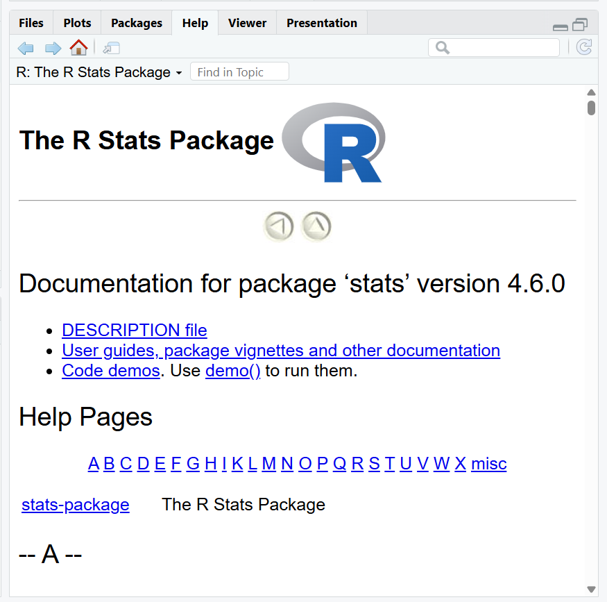
    
\newpage
    
### A. T-test and Bartlett's test of equal variance
    
To perform a test for differences between two-independent samples, we will use the `t.test()` function. 

Let's perform a two-group independent T-test to see if there were any significant differences between the control and HELP intervention treatment groups at 6 months for the CESD scores.

We have to supply:

* the variable of interest `cesd1` for the CESD scores at 6 months
* the group variable `treat` which was coded 0=control and 1=HELP intervention treatment group
* and the dataset for these data `helpdata`

```{r}
# compare cesd scores at 6m by treatment group
# NOTE: var.equal= FALSE is default
# unpooled t-test run by default
t.test(cesd1 ~ treat,
       data = helpdata)
```

\newpage

Notice that the default setting in `t.test()` for `var.equal` is `FALSE` which means that the UNPOOLED T-test is performed in R by default.


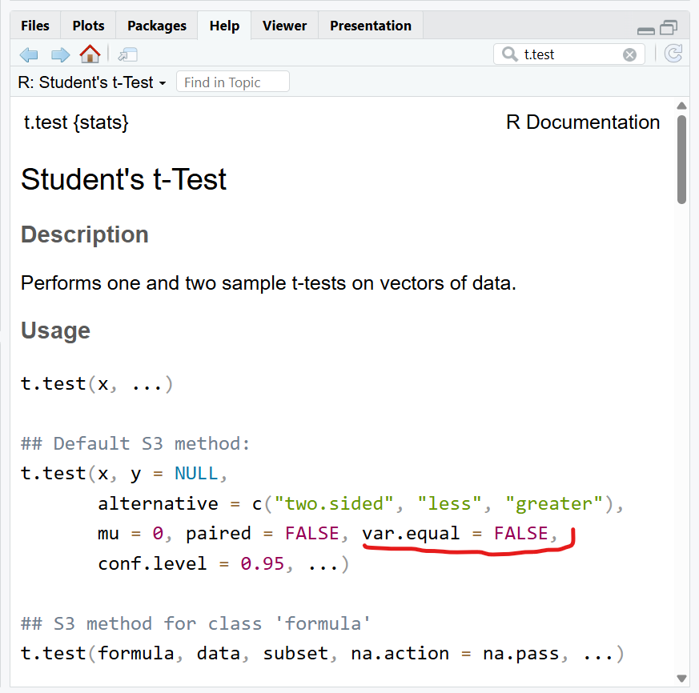
\newpage

To run a pooled T-test, we just need to set `var.equal=TRUE`.

```{r}
# run pooled t-test
t.test(cesd1 ~ treat,
       var.equal = TRUE,
       data = helpdata)
```

\newpage

While the default output from this function is useful, there is actually a lot of results generated by the `t.test()` function. Let's save all of this output and take a look.

```{r}
# save results in an object
tt_cesd1 <- 
  t.test(cesd1 ~ treat,
         data = helpdata)
```

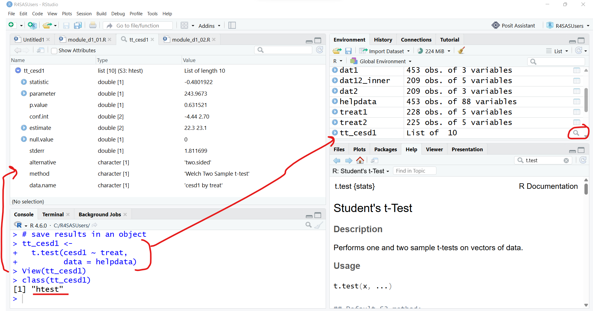

\newpage

We can also find out the expected output from the `t.test()` function by reading the "VALUE" section of the help page for `t.test`. Notice that `tt_cesd1` object we saved is of class "htest".
    
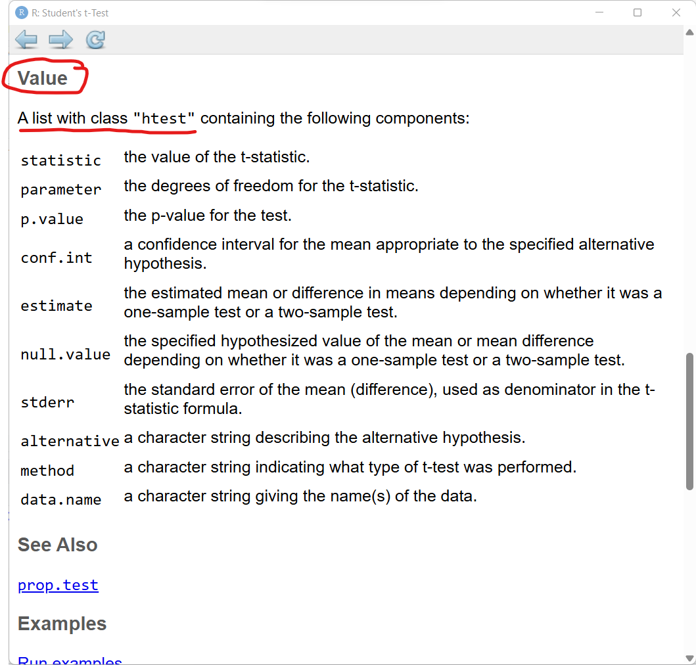

\newpage

Unfortunately, `t.test()` does not also automatically include a check for the assumption of equal variance to help decide whether you want the pooled or unpooled results. Instead you have to perform the test for equal variance separately.

::: {.callout-tip}
## Finding more options with related functions

It is useful to scroll through the entire help file for a given function. There is a section often towards the end labeled "See Also" that will usually link to other functions similar to or related to the function you are currently looking at.
:::

I like running `bartlett.test()`. However, if we open the help page for `bartlett.test()`, we can scroll down to a section called "See Also" to see other functions that perform similar tests for equal variance including: 

* `var.test` for the special case of comparing variances in two samples from normal distributions; 
* `fligner.test` for a rank-based (nonparametric) 
k-sample test for homogeneity of variances; 
* `ansari.test` and 
* `mood.test` for two rank based two-sample tests for difference in scale.

\newpage

```r
help(bartlett.test, package = "stats")
```

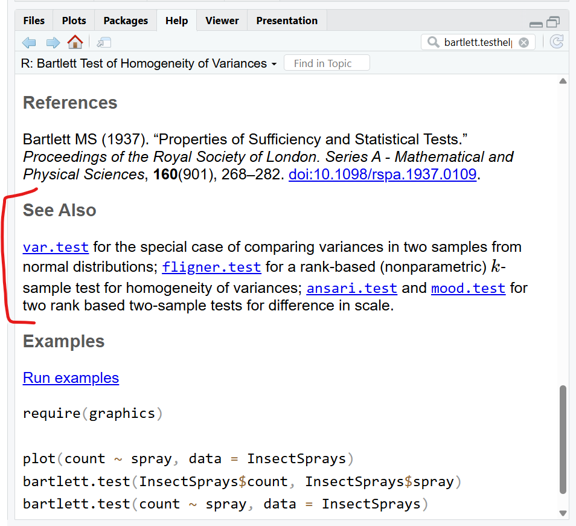

\newpage

As you can see the test for variance differences is not statistically significant (p > 0.05), so we cannot reject the null hypothesis and conclude that the assumption of equal variance is met. 

```{r}
# check assumption of equal variance
bartlett.test(cesd1 ~ treat,
              data = helpdata)
```


Additionally, while the output for the `t.test()` above gives us the test statistic and p-value and the means for each group, it does not give us the standard deviations for each group, which is often helpful when communicating results.

So, we can use the `dplyr::summarise()` function to create these custom statistic and add `group_by()` to list the means and sd's for each group.

::: {.callout-note}
## package::function syntax

Once you load a package into your R computing session, you can just simply call the functions as you need them. However, occasionally packages might have the same function name which do very different things. For example, the [`Hmisc`](https://cran.r-project.org/web/packages/Hmisc/index.html) and [`psych`](https://cran.r-project.org/web/packages/psych/) packages both have a function called `describe()` for getting descriptive statistics which produce very different results. So, it can be helpful to call a function using its "formal" function call of `packagename::function()`, like `dplyr::summarise()` to avoid confusion.
:::

\newpage

```{r}
# look at means and sd's of each group
# check to see if ratios of SDs is < 2
# which is another "rule of thumb" for
# checking the equal variance assumption
helpdata %>%
  group_by(treat) %>%
  summarise(
    meancesd1 = mean(cesd1, na.rm = TRUE),
    sdcesd1 = sd(cesd1, na.rm = TRUE)
  )
```

::: {.callout-tip}
## Add sample sizes, counts of missing and non-missing

There are a couple of ways to get sample sizes with our `dplyr::summarise()` step. One is to use the `n()` function, but that will only show us the number of rows in the dataset for the given filter, regardless of the amount of missing values for a given variable. To get the amounts of missing (or non-missing), we can use the `is.na(varname)` function which returns a vector of `TRUE` and `FALSE` for `varname`. If we wrap `sum()` around that vector the `TRUE`'s are treated as 1's and the `FALSE`'s are 0's, so `sum(is.na(varname))` will return the number of `TRUE`'s or non-missing values. We can also use the `!` operator for the "logical NOT" operator, to get the amount of non-missing values using `sum(!is.na(varname))`.
:::

Redo table above adding the sample size counts:

* the number of rows for each `treat` treatment group
* the amount of non-missing values for the CESD at 6m (`cesd1`)
* the amount of missing values for the CESD at 6m (`cesd1`)

```{r}
# OPTIONAL - Sample Sizes
helpdata %>%
  group_by(treat) %>%
  summarise(
    all_n = n(),
    n_cesd1 = sum(!is.na(cesd1)),
    miss_cesd1 = sum(is.na(cesd1)),
    meancesd1 = mean(cesd1, na.rm = TRUE),
    sdcesd1 = sd(cesd1, na.rm = TRUE)
  )
```


#### SAS Code for T-test

```default
* t-test;
proc ttest data=help;
  class treat;
  var cesd1;
  run;
```

\newpage

### B. Effectsizes - Cohen's d

In addition to reporting the means and standard deviations of the two-groups, plus the test statistic, degrees of freedom and p-value, it is also helpful to report the effect sizes for tests and models as well. For a T-test, we could compute the effectsize Cohen's d to report along with our results.

There is a good package called `effectsize` that will allow us to compute Cohen's d using nearly identical syntax to the `t.test()`.

```{r}
library(effectsize)
cohens_d(cesd1 ~ treat,
         pooled_sd = TRUE,
         data = helpdata)
```

::: {.callout-note}
## Another useful suite of packages, `easystats`

The `effectsize` package is part of another useful suite of packages called [`easystats`](https://easystats.github.io/easystats/).
:::

\newpage

### C. Wilcox (Mann Whitney) Test
    
If we have non-normal data or other reasons for running a non-parametric version of a T-test, we can use the `wilcox.test()` function to perform a two-independent sample group test, which is also commonly known as the "Mann Whitney Test", see `help(wilcox.test, package = "stats")`.

```{r}
# run non-parametric two-group test =======================
wilcox.test(cesd1 ~ treat,
            data = helpdata)
```

#### SAS code for non-parametric two-group independent test

```default
* non-parametric two-group test;
proc npar1way data=help wilcoxon;
  class treat;
  var cesd1;
  run;
```

\newpage

### D. Chi-square test
    
We saw yesterday that we could get a Chi-Square Test performed using the `CrossTable()` function from the `gmodels` package and also using `tbl_cross()` from the `gtsummary` package. However, there is also a simple `chisq.test()` function in the base R `stats` package.

::: {.callout-note}

## Note on default settings

Be sure to read the help pages `help(chisq.test, package = "stats")` and note that the `chisq.test()` performs a continuity correction by default.

:::

Since we've looking at differences above between the [CESD scores](https://www.apa.org/pi/about/publications/caregivers/practice-settings/assessment/tools/depression-scale) at 6 months between the control and HELP intervention groups, let's use the recommended split of CESD scores at 16 and then use these two dichotomous categories to perform a Chi-square test of independence for `cesd1 > 16` versus `cesd1 <= 16`.

```{r}
# compute cesd1 > 16;
helpdata <- helpdata %>%
  mutate(
    cesd1_gt16 = cesd1 > 16
  )
```

Use this new variable `cesd1_gt16` for the `chisq.test()`.

```{r}
# built-in chisq.test() function
# Yates continuity correction TRUE by default
chisq.test(
  helpdata$cesd1_gt16, 
  helpdata$treat
)
```

\newpage

We could also perform this test using `gmodels::CrossTable()`.

```{r}
library(gmodels)
gmodels::CrossTable(helpdata$cesd1_gt16, 
                    helpdata$treat,
                    expected=TRUE,
                    prop.r=FALSE,
                    prop.t=FALSE,
                    prop.chisq=FALSE,
                    chisq=TRUE,
                    fisher=TRUE,
                    format = "SAS")
```

\newpage

We could also create a nice factor type variable with helpful labels for these crosstab tables as well. Let's make one and use it with `gtsummary::tbl_summary()` which can also perform a Chi-square or Fisher's exact test. 


```{r}
# add factor variable
helpdata$cesd1_gt16.f <-
  factor(
    helpdata$cesd1_gt16,
    levels = c(FALSE, TRUE),
    labels = c("CESD <= 16",
               "CESD > 16")
  )
```


```{r}
#| label: tbl-reg
#| echo: true
#| tbl-pos: H

library(gtsummary)
# option 1 with tbl_summary()
helpdata %>%
  select(cesd1_gt16.f, treat) %>%
  tbl_summary(
    by = treat,
    label = list(
      cesd1_gt16.f = "CESD Split at 16")
  ) %>%
  modify_header(
    stat_1 = "**Control**", 
    stat_2 = "**Treatment**"
  ) %>%
  bold_labels() %>%
  add_p(
    test = cesd1_gt16.f ~ "chisq.test",
    test.args = list(cesd1_gt16.f ~ list(correct = TRUE)),
    pvalue_fun = label_style_pvalue(digits = 3)
  )
```

\newpage

::: {.callout-important}
## Handling missing values for Chi-square tests

It turns out that within `gtsummary` the two options for making these tables and running the tests of independence for these categorical variables, produce different results. By default, `chisq.test()`, `gmodels::CrossTable()` and `gtsummary::tbl_summary()` take out the missing data first and then run the Chi-square test. **BUT** `gtsummary::tbl_cross()` treats the missing values as their own "unknown category which changes the test results.
:::

Compare missing data handling for `gtsummary::tbl_cross()`.

Notice the row for "unknown" for the missing values.

```{r}
#| label: tbl-reg2
#| echo: true
#| tbl-pos: H

# option 2 with tbl_cross()
helpdata %>%
  tbl_cross(row = cesd1_gt16.f, 
            col = treat,
            percent = "column",
            digits = c(0, 2),
            label = list(
              cesd1_gt16.f = "CESD Split at 16",
              treat = "Treatment Group"
            )) %>%
  bold_labels() %>%
  add_p(test = "chisq.test",
        test.args = list(correct = TRUE),
        pvalue_fun = label_style_pvalue(digits = 3))
```

\newpage

Remove the missing values with `filter(complete.cases(.))` and now the p-values match the results above.

```{r}
#| label: tbl-reg3
#| echo: true
#| tbl-pos: H

# get all non-missing cases and re-run
h1 <- helpdata %>%
  select(cesd1_gt16.f, treat) %>%
  filter(complete.cases(.))

h1 %>%
  tbl_cross(row = cesd1_gt16.f, 
            col = treat,
            percent = "column",
            digits = c(0, 2),
            label = list(
              cesd1_gt16.f = "CESD Split at 16",
              treat = "Treatment Group"
            )) %>%
  bold_labels() %>%
  add_p(test = "chisq.test",
        test.args = list(correct = TRUE),
        pvalue_fun = label_style_pvalue(digits = 3))
```

\newpage

#### SAS Code for Crosstables with Chi-square and Fisher's Exact tests

```default
* compute cesd1 > 16;
data help;
  set help;
  if not missing(cesd1) then cesd1_gt16 = cesd1>16;
  else cesd1_gt16 = .;
  run;

* chi-square test;
proc freq data=help;
  table cesd1_gt16 * treat / chisq fisher norow nopercent;
  run;
```

\newpage

### E. ANOVA (Analysis of Variance)

In addition to comparisons of two-groups, let's also perform some comparisons of the 4 race/ethnicity groups with the `racegrp` variable to compare `mcs` (mental component scale from SF36  quality of life scale) scores at baseline.

We will use a similar formula syntax like above with the `~` tilde operator using the `aov()` function from the `stats` package.

$$y \sim x$$

We will perform the test and save the results in an output object called `fit.aov`. And then we will use this model output object as input to other functions to help us parse the model results.

```{r}
# the aov() function
# gives the global test for the "group" effect
fit.aov <- aov(mcs ~ racegrp, 
               data=helpdata)
fit.aov
```

The default output is pretty basic. We only get the components of the F-test for the `racegrp` between subjects effect. But notice there is no p-value. How do we get that?

\newpage

We need to use the `summary()` function again. Remember that I mentioned this is a "generic function" in R that "adapts" based on the kind of R object we input to `summary()`.

```{r}
# what kind of object is fit.aov
class(fit.aov)
```

This model object is of class "aov" (analysis of variance) and "lm" (linear model). Let's click on the magnifying glass icon in the "Global Environment" for the `fit.aov` object to see what is included with this object. You can also run the function `View(fit.aov)` which will also open the object viewer.

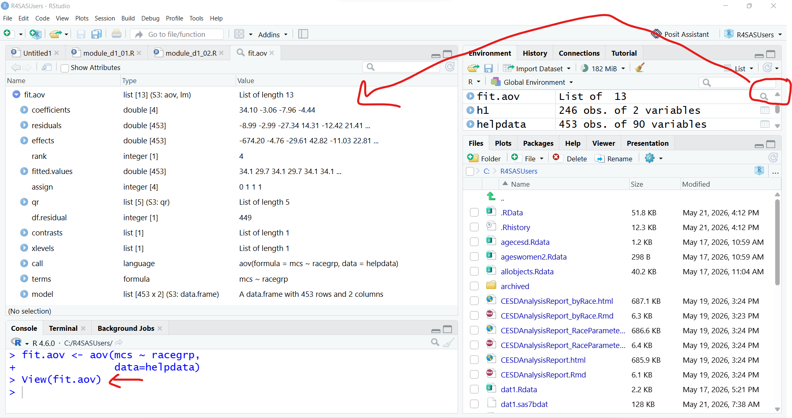
    
We can "look" as these elements inside the object in the viewer. Some of the elements are data.frames that contain other data element. For example, click on the table icon next to the line that says "coefficients", this creates the code `fit.aov[["coefficients"]]` and when you hit return in the "Console" then displays the "linear model" coefficients from the ANOVA model.

\newpage
    
Another way to select and display the elements within the `fit.aov` model is basically the same as selecting variables out of a `data.frame` dataset object.

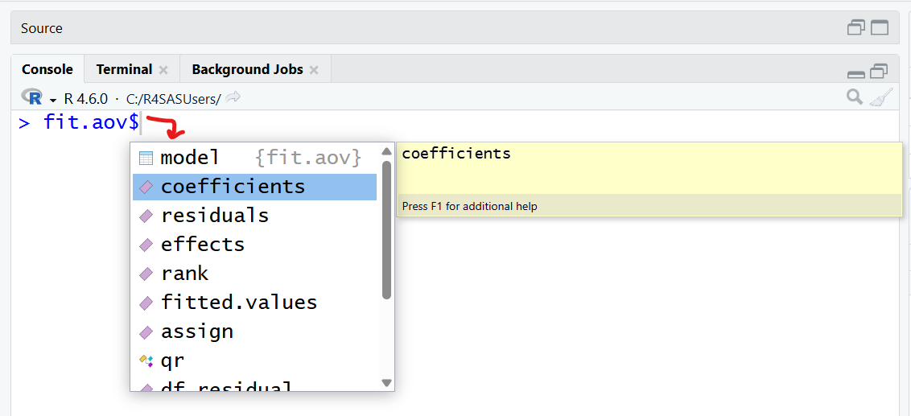
    
Notice that these commands yield the same results:

```{r}
fit.aov[["coefficients"]]
fit.aov$coefficients
```

The other thing to notice is that besides the `(Intercept)` term, the remaining 3 coefficients are:

* `racegrphispanic`
* `racegrpother`
* `racegrpwhite`

Remember, the 4 race/ethnicity groups were: "black", "hispanic", "other" and "white" in alphabetical order. So, by default R chooses the FIRST category to be the reference category. This is why there are 3 coefficients - one for each pairwise comparison of the other 3 race/ethnicity groups to the "reference" category "black". This is basically the same approach as creating dummy variable coding to essentially perform an ANOVA via linear regression.

\newpage

There are 13 total elements inside of `fit.aov` include residuals and fitted values, for example.

Now that we understand a bit better what all is included within the `fit.aov` object, how can we get the F-test model results and p-values and such. We need to run `summary()` for the `fit.aov` object which technically runs `summary.aov()`, see help:

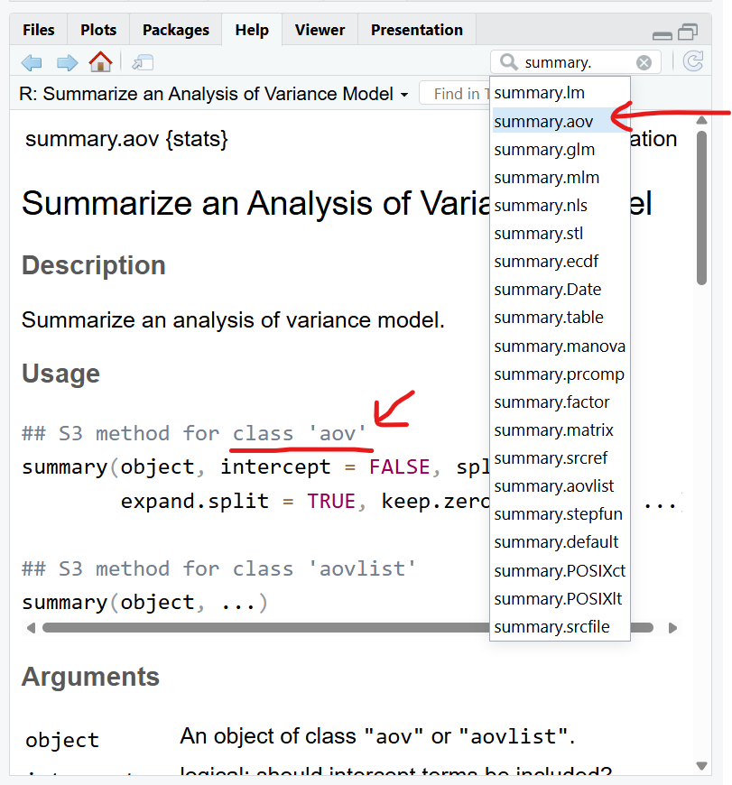
    
\newpage
    
The output "Value"'s from `summary.aov()` include sums of squares, degrees of freedom as well as the F-value and p-values `"Pr(>F)"`.

```{r}
# get better formatted output
summary(fit.aov)
```

This finally gives us a helpful ANOVA output table with the F-test details which shows that for the MCS scores at baseline there are statistically significant differences between the 4 race/ethnicity groups: _F(3, 449)_ = 5.698, _p_=.000778.

We could also have used the `anova()` generic function as well to get this ANOVA table:

```{r}
anova(fit.aov)
```

\newpage

Help window for `anova.lm()`:

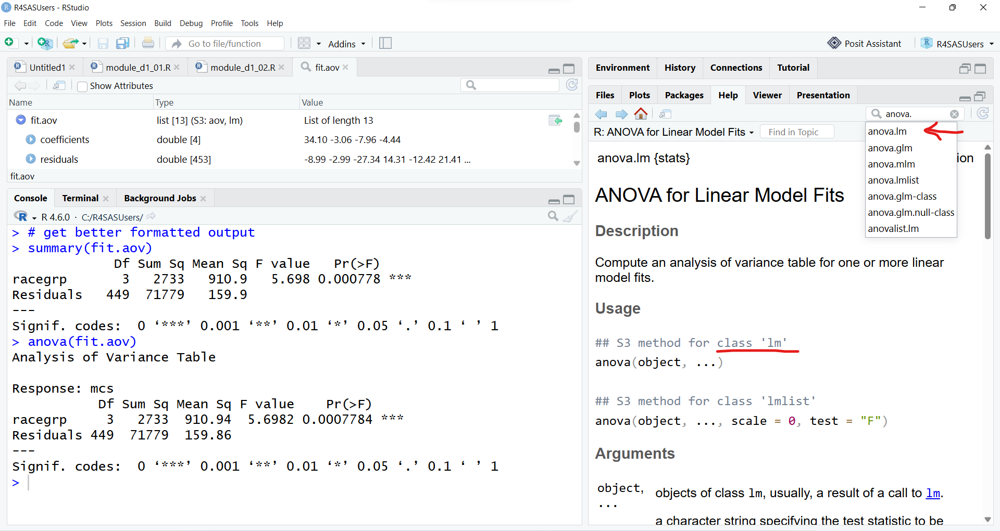
    
Let's save the `summary.aov()` output object and take a look at it as well:

```{r}
sfitaov <- summary(fit.aov)
```

This object is basically a `data.frame` that has the elements of the ANOVA table. 

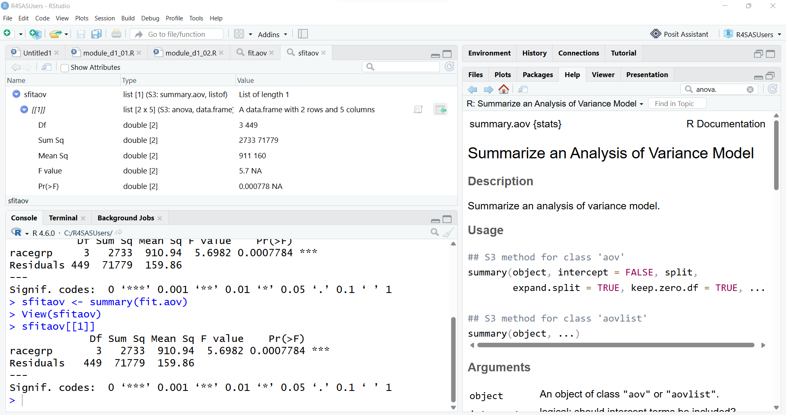

\newpage

For example, the p-value can be pulled out by running either of these commands:

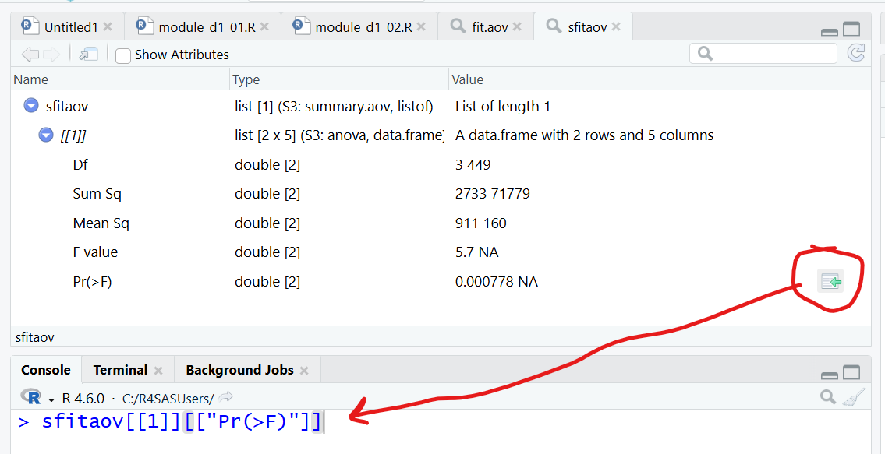

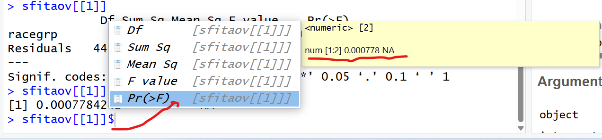

```{r}
sfitaov[[1]][["Pr(>F)"]]
sfitaov[[1]]$`Pr(>F)`
```

\newpage

Let's also take a look at some ways to visualize the "effects" from the ANOVA model. One package that is helpful to visualize model results is the `effects` package. Let's use the `allEffects()` function on this model output `fit.aov` and make a plot of these effects:

```{r}
# use effects package to get
# effects plots - basically a plot
# of the means with 95% confidence intervals
# for each group, racegrp

library(effects)

# make the effects plot
plot(allEffects(fit.aov))
```

\newpage

We should also run the pairwise posthoc tests to see where the differences lie between these 4 race/ethnicity groups. There are a few ways to do this, but one package that is helpful is the `emmeans` package. For now, I'll use a the Bonferroni alpha-inflation correction for multiple pairwise tests. You can see the other correction options by viewing `help(summary.emmGrid, package="emmeans")` - scroll down to the "P-Value Adjustments" section to learn more.

```{r}
# get post hoc tests
# to see the list of p-value adjustments for
# multiple comparisons type
# help(summary.emmGrid, package="emmeans")

library(emmeans)
# bonferroni p-value adjustments
emmeans(fit.aov, 
        specs = pairwise ~ racegrp,
        adjust = "bonferroni")
```

Given these Bonferroni adjusted p-values, the statistically significant (p < .05) differences are between "black - other" _(p=.0156)_ and between "black - white" _(p=.0046)_.

\newpage

And finally it would be good to still check the assumption of equality of variance for the ANOVA. I'll use `bartlett.test()` again. The result is a non-significant p-value, so I'll conclude the assumption of equality of variance is met.

```{r}
# bartlett's test for homogeneity of variances
# note: put the formula back in
bartlett.test(mcs ~ racegrp, 
              data=helpdata)
```

::: {.callout-note}
## Unequal group variances - Welch's test

If you do end up with a statistically significant equality of variance test and need to run an adjusted ANOVA, there is the `oneway.test()` function from the `stats` package.

```r
# One-way ANOVA assuming equal variance
oneway.test(mcs ~ racegrp, var.equal=TRUE, data=helpdata)

# One-way ANOVA assuming unequal variance = Welch's test
oneway.test(mcs ~ racegrp, var.equal=FALSE, data=helpdata)

# Learn more
help(oneway.test, package = "stats")
```
:::

\newpage

#### SAS Code for ANOVA

```default
* ANOVA
  compare mcs between 4 race groups
  run bonferroni adjusted pairwise comparisons
  run homogenity of variance
  and get welch's adjusted test if needed;

proc ANOVA data=help;
	class racegrp;
	model mcs = racegrp;
	means racegrp / bon hovtest welch;
	run;
```

\newpage

### F. Linear Regression

#### Linear regression approach to ANOVA
    
As we saw above, the analysis of variance model object is of both class `aov` and `lm`. You can actually use the `lm()` function to also perform an ANOVA for a group variable. You will get the same `anova()` table results.

```{r}
# use lm to perform an ANOVA ==============================
# ANOVA
# the aov() function
# gives the global test for the "group" effect
fit.lmaov <- lm(mcs ~ racegrp, 
                data=helpdata)
summary(fit.lmaov)
```

\newpage

```{r}
anova(fit.lmaov)
sfitlmaov <- summary(fit.lmaov)
```

Let's make some nicer tables for these results using the `tbl_regression()` function from the `gtsummary` package.

The following code chunks show how to build the regression table elements. 

The basic table:

```{r}
#| label: tbl-reg4
#| echo: true
#| tbl-pos: H

# formatted output using tbl_summary()
# from gtsummary package
# racegrp sorted alphabetically
# first group "black" used a reference
fit.lmaov %>%
  tbl_regression()
```

\newpage

Add the overall p-value results for the whole ANOVA table (e.g. the `racegrp` effect).

```{r}
#| label: tbl-reg5
#| echo: true
#| tbl-pos: H

# add global p-value
# for racegrp as a whole
fit.lmaov %>%
  tbl_regression() %>%
  add_global_p()
```

\newpage

Finally add custom model fit statistics using the `add_glance_table()` function to add select model fit statistics to your regression results table. This function works in concert with the [`broom` package](https://broom.tidymodels.org/) which is part of the [`tidymodels`](https://www.tidymodels.org/) suite of packages, which is explained below.

```{r}
#| label: tbl-reg6
#| echo: true
#| tbl-pos: H

# add model statistics
fit.lmaov %>%
  tbl_regression() %>%
  add_glance_table(
    include = c(r.squared, 
                adj.r.squared,
                p.value)
  )
```

\newpage

To see what model statistics are available, we need to look at what the `broom` package is able to pull out from the `fit.lmaov` model object. 

The `broom::glance()` function computes many model fit statistics we can choose from to display as an add on option to `gtsummary::tbl_regression()` using the `add_glance_table()` function.

```{r}
# model statistics available
library(broom)
bg <- broom::glance(fit.lmaov)
bg
names(bg)
```

\newpage

#### More traditional linear regression model

Let's stay with looking at the `mcs` at baseline and perform a regression model of the association between the `mcs` and `cesd` plus `age` and gender `female`. 

```{r}
# fit a regression model ==================================
fit.lmreg <- lm(mcs ~ age + female + cesd,
                data = helpdata)
summary(fit.lmreg)
```

\newpage

Similar to what we did above, let's use the `effects` package again to plot the effects (e.g. visualize the slopes or effects of each coefficient in the model).

```{r}
# also look at model effects for this lm model
# library(effects)
alleff <- allEffects(fit.lmreg)
# make the effects plot
plot(allEffects(fit.lmreg))
```

\newpage

We can make a nicer formatted table using `gtsummary::tbl_regression()`. I have added some additional options to this table:

* I added `intercept=TRUE` to include the intercept
* I added `estimate_fun = ~ style_number(.x, digits = 3)` to format all of the p-values for each coefficient to 3 decimal places
* and I included some custom fit statistics using `add_glance_table()`.

```{r}
#| label: tbl-reg7
#| echo: true
#| tbl-pos: H

# make formatted table
# include intercept
# format digits to 3 decimals for betas
fit.lmreg %>%
  tbl_regression(
    intercept = TRUE,
    estimate_fun = ~ style_number(.x, digits = 3)
  ) %>%
  add_glance_table(
    include = c(r.squared, 
                adj.r.squared,
                p.value)
  )
```

\newpage

#### Side-by-side Model Comparisons

Another nice package for displaying linear model results, is the [`modelsummary` package](https://modelsummary.com/). It is especially useful for comparing models side-by-side. For example, let's run two models and compare them:

* MODEL 1: `mcs`~ `cesd` _(direct association)_
* MODEL 2: `mcs`~ `cesd` + `age` + `female` _(association between `cesd` and `mcs` adjusted for `age` and gender `female`)_

Before you can perform the side-by-side comparison, we have to define the models we want to compare by creating a `list` object that essentially has the 2 model functions defined.

```{r}
# modelsummary package alternative to gtsummary ===========
library(modelsummary)
models <- list(
  "main" = lm(mcs ~ cesd, data=helpdata),
  "adj" = lm(mcs ~ age + female + cesd, data=helpdata)
)
```

Then we can display the results using `modelsummary()`. There are many options we can add but for now I'm asking to display the confidence intervals for each coefficient.

```{r}
#| label: tbl-reg8
#| echo: true
#| tbl-pos: H

# show side-by-side model results, add confidence intervals
modelsummary(models, statistic = 'conf.int')
```

These results also provide for the R2 of each model. As we can see the R2 for the MAIN model was `r2=.465` and for the ADJ model was `r2=.468`, so the difference for adding `age` and `female` to the model was a change in `r2=.003`.

\newpage

We can get a formal test of the differences in these two model by using the `anova()` function in the `stats` package.

```{r}
# formal test of model comparisons
main <- lm(mcs ~ cesd, data=helpdata)
adj <- lm(mcs ~ age + female + cesd, data=helpdata)
anova(main, adj)
```

The change in r2 between these two models was small and as we can see the F-test for these differences was not statistically significant, p=.3441.

I also like seeing the standardized regression coefficients which are also effect sizes useful for interpreting the weight of each coefficient in the model without being affected by different units or scales of the different variables. The [`modelsummary` package](https://modelsummary.com/) also leverages features from the [`parameters` package](https://easystats.github.io/parameters/), which is part of the [`easystats`](https://easystats.github.io/easystats/) suite of packages..

\newpage

We can see more details about the other packages that get installed and loaded along with `modelsummary` by looking at the DESCRIPTION for the `modelsummary` package in the "Help" window and look at the list of packages mentioned in "Imports:"

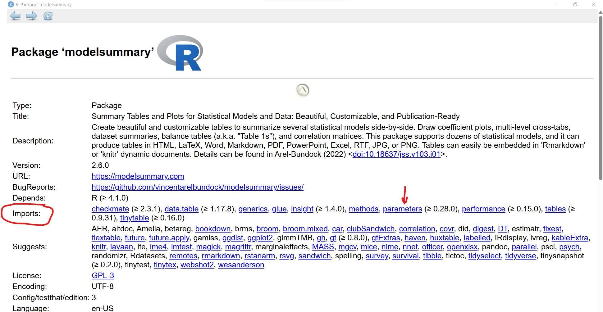
    
    
The `modelsummary` package also has a function `modelplot()` that creates a visual plot of each model coefficient estimate along with their 95% confidence intervals. This can be helpful for comparing the estimates from two different models (such as `main` versus `adj`):
    
```{r}
# plot comparisons of model coefficients,
# remove intercept coefficient from plot
modelplot(models, coef_omit = "(Intercept)")
```

    
We can add `standardize = "refit"` to `modelsummary()` to get the standardized coefficients in our side-by-side table. Learn more with `help(standardize_parameters, package= "parameters")`.
    
```{r}
#| label: tbl-reg9
#| echo: true
#| tbl-pos: H

# also get the standardized coefficients
modelsummary(models, 
             standardize = "refit",
             statistic = 'conf.int')
```

\newpage

#### OPTIONAL- `olsrr` package

Another really good package for diving into everything for an "ordinary least squares" regression model, is the [`olsrr` package](https://olsrr.rsquaredacademy.com/). This package has a number of really good functions for displaying results, evaluating model fit diagnostics and tests and running variable selection procedures and much more we won't have time to get into. But here is a glimpse of what you can do to get the model results, evaluate multicollinearity statistics, plot model diagnostics and test for the normality of the residuals.

\newpage

::: {.landscape}

```{r}
# olsrr::ols_regress gives a nice summary
# including the standardized regression coefficients
library(olsrr)
olsrr::ols_regress(fit.lmreg)
```

:::

\newpage

```{r}
# olsrr also has good model fit checks
# like multicollinearity checks, 
# VIF and condition index
# get VIF and multicollinearity stats
ols_coll_diag(fit.lmreg)
```

\newpage

```{r}
# diagnostic plots
# check for new output windows
ols_plot_diagnostics(fit.lmreg)
```

\newpage

```{r}
# normality tests for residuals
ols_test_normality(fit.lmreg)
```

\newpage

#### SAS Code for Linear Regression

```default
* Regression;

proc reg data=help;
  model mcs = age female cesd / STB CLB;
  run;
  
* Compare "main" vs "adj" models
  "main" for mcs = cesd
  "adj"  for mcs = cesd + age + female;

proc reg data=help 
         plots=none outest=rsq_data rsquare;
  var mcs cesd age female;
  model mcs=cesd;
  run ;
  model mcs=cesd age female;
  run ;
quit;

* get change in r2 between the 2 models;

data rsq_extended;
  set rsq_data;
  delta_rsq=dif(_rsq_);
  delta_indvars=dif(_in_);
run;

proc print data=rsq_extended; run;

* Test coefficients for age and female = 0
  which is a test of covariates
  significant or not, "main" vs "adj";

proc reg data=help;
  model mcs=cesd age female;
  test age=0, female=0;
  run;
  quit;
  
```

\newpage

### G. Logistic Regression

Moving from linear to logistic regression is very straightforward. Instead of using the `lm()` function, we will use the `glm()` function to fit "generalized linear models". In fact, the `glm()` function can be used to perform simple linear regression as well. More about that below.

Since we've been looking at a regression model for the `mcs` at baseline, let's dichotomize this outcome into MCS scores <= 50 and MCS scores > 50. The SF36 `mcs` and `pcs` scores have been population normalized into "T-scores" that have been re-scaled into scales from 0-100 with a population mean of 50 and population standard deviation of 10. So, individuals who have MCS scores > 50 are considered to have mental health quality of life scores better than the population average.

I added a `table()` of the split results - as you can see there are only 52/435 (11.5%) of these individuals in the HELP dataset that had mental quality of life scores better than the population average. This makes sense since the HELP participants include a high proportion of homeless and people with unstable housing. So, keep this in mind when reviewing the logistic regression results.

```{r}
# split score mcs > 50
helpdata <- helpdata %>%
  mutate(mcs_gt50 = as.numeric(mcs > 50))

table(helpdata$mcs_gt50)
```

\newpage

To fit a logistic regression model using `glm()`, the syntax is nearly identical to `lm()`, except we MUST define the `family = xxxxx` argument.

See `help(glm, package="stats")`.

::: {.callout-important}
## `family=gaussian` default setting for `glm()`

Notice that `family=gaussian` is the default which is the setting for simple linear regression!. So, if you forget to set `family=binomial` you'll end up running a linear regression instead of a logistic regression.
:::


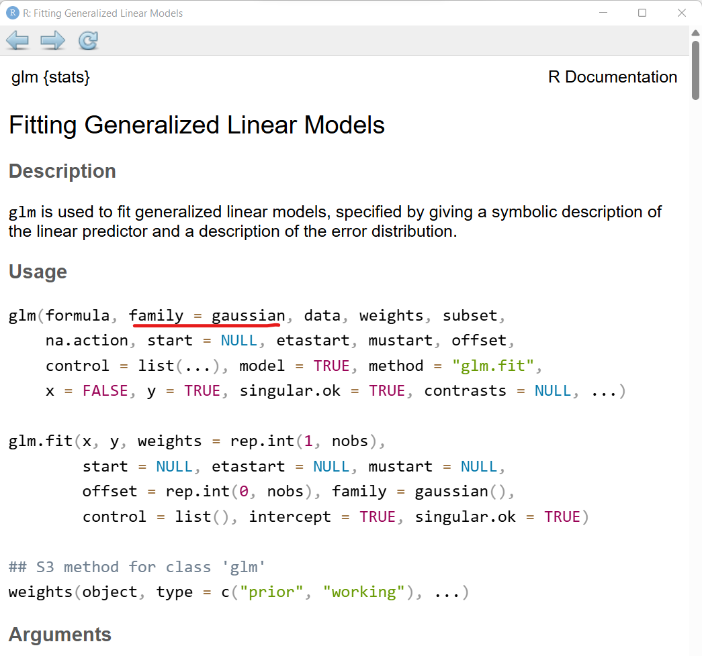

\newpage

Scroll down to "Arguments" and click on a link for the details on "family" - notice there are many options besides binomial with the logit link function. If you want to run a simple linear regression, just keep the default `family=gaussian`. You can also run a Poisson regression for count data or use Gamma distributions for time-to-event data.

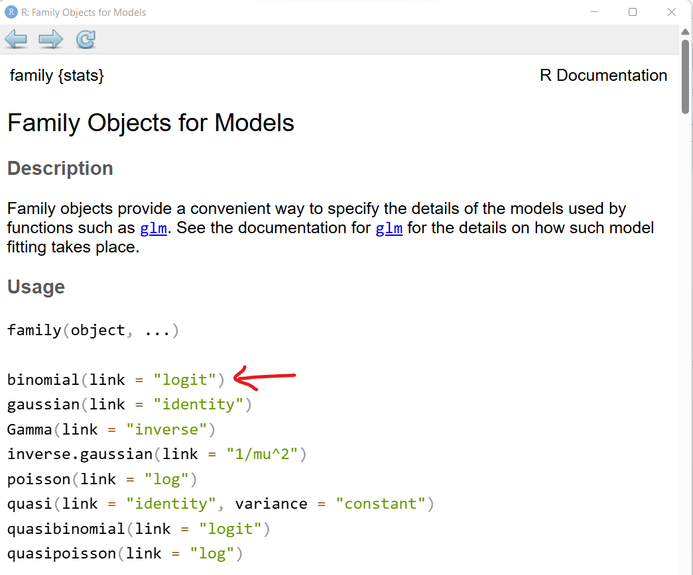

\newpage

So, when we want to run a logistic regression, we need to choose `family = binomial` to get the logit link function for the dichotomous outcome `mcs_gt50`.

```{r}
# fit a logistic regression model
# use glm instead of lm
# and add family = binomial
fit.logreg <- 
  glm(mcs_gt50 ~ age + female + cesd,
      family = binomial,
     data = helpdata)
```

See the model results

```{r}
summary(fit.logreg)
```

These model coefficients (Estimate's) do not look like odds ratios. Why not?

\newpage

The linear logistic-regression or the linear logit model is given by this equation:

$$ \pi_i = \frac{1}{1+exp[-(\alpha + \beta X_i)]} $$

where $\pi_i$ is the probability of the desired outcome.

Given this equation then

$$ Odds = \frac{\pi}{1 - \pi} $$

and

$$ Logit = log_e(\frac{\pi}{1 - \pi}) $$

and

$$ Logit = \alpha + \beta X_i $$

So, to get the odds ratios, we have to compute the exponential function of the coefficients using the `exp()` function for the coefficients which you can get via `coef(fit.logreg)`:

```{r}
# to see raw coefficients
coef(fit.logreg)

# exponentiate the coefficients
#to get odds ratios
exp(coef(fit.logreg))
```

\newpage

We'll make a better of these tables in a moment. but first let's take a look at what model fit statistics are available via the `broom` package.

```{r}
# model statistics available
library(broom)
bg <- broom::glance(fit.logreg)
bg
names(bg)
```

Let's use`gtsummary::tbl_regression` with `exponentiate = TRUE` to get a nicer table of logistic regression model results with the odds ratios (OR's) and the confidence intervals for the OR's.

```{r}
#| label: tbl-reg10
#| echo: true
#| tbl-pos: H

# make formatted table
# include intercept
# remember to exponentiate the coefficients
# format digits to 3 decimals for betas
# and do 3 decimal digits for p-values
fit.logreg %>%
  tbl_regression(
    intercept = TRUE,
    exponentiate = TRUE,
    estimate_fun = ~ style_number(.x, digits = 3),
    pvalue_fun = label_style_pvalue(digits = 3)
  ) %>%
  add_glance_table(
    include = c(AIC, BIC, nobs)
  )
```

\newpage

#### SAS Code for Logistic Regression

```default
* logistic regression;
* compute mcs > 50;
data help;
  set help;
  if not missing(mcs) then mcs_gt50 = mcs > 16;
  else mcs = .;
  run;

proc logistic data=help plots=roc descending;
  model mcs_gt50 = age female cesd / ctable lackfit;
  run;
```

---

\newpage

## 2. Merging Datasets

For this exercise we will use 4 datasets which were subsets of the original `helpdata` dataset.

* `dat1.Rdata`: all baseline cases, with only these variables: `id`, `age`, `cesd`
* `dat2.Rdata`: 12 month cases, with these variables: `id`, `female`, `cesd2`
* `treat1.Rdata`: only control group cases, with these variables: `id`, `treat`, `age`, `cesd`, `pcs`
* `treat2.Rdata`: only the treatment intervention cases, with these variables: `id`, `treat`, `age`, `cesd`, `pcs`

First load the datasets:

```{r}
load(file = "help.RData")
load(file = "dat1.Rdata")
load(file = "dat2.Rdata")
load(file = "treat1.Rdata")
load(file = "treat2.Rdata")
```

### R code to perform joins (adding columns)

To perform an "inner join" which keeps all cases in common between both datasets, we can use the `inner_join()` function from `dplyr`. See [Chapter 19.4 in "R for Data Science (2e)"](https://r4ds.hadley.nz/joins.html#how-do-joins-work) for more detailed explanation and helpful illustrations.

For the joins below, we are using `id` as our "primary key" to identify the cases we want to match up between both datasets.

```{r}
# join by ids
# keep only cases with both 
# cesd and cesd2
dat12_inner <- 
  inner_join(x = dat1,
             y = dat2,
             by = join_by(id))
head(dat12_inner)
```

An `outer_join()` will keep ALL cases regardless of which dataset they come from.

```{r}
# keep all cases from either dataset
dat12_full <- 
  full_join(x = dat1,
            y = dat2,
            by = join_by(id))
head(dat12_full)
```

If we have a primary dataset that we want to define which cases we want to keep, we can perform a `left_join()` to keep all cases in the 1st dataset and only add cases from the 2nd dataset that match.

```{r}
# keep only cases from left (first)
# dataset
dat12_left <- 
  left_join(x = dat1,
            y = dat2,
            by = join_by(id))
head(dat12_left)
```

\newpage

### SAS code to perform joins (add columns)

For the code below, we will need to have these 4 SAS datasets:

* `dat1.sas`: all baseline cases, with only these variables: `id`, `age`, `cesd`
* `dat2.sas`: 12 month cases, with these variables: `id`, `female`, `cesd2`
* `treat1.sas`: only control group cases, with these variables: `id`, `treat`, `age`, `cesd`, `pcs`
* `treat2.sas`: only the treatment intervention cases, with these variables: `id`, `treat`, `age`, `cesd`, `pcs`

To perform an INNER JOIN in SAS using PROC SQL:

```default
* perform inner join;
proc sql;
	create table dat12_inner as
	select * from rforsas.dat1 as x join rforsas.dat2 as y
	on x.id = y.id;
quit;

* view contents of inner join
  and view in data viewer;
proc contents data=dat12_inner;
run;
```

To perform an OUTER JOIN in SAS using PROC SQL:

```default

* perform outer join;
proc sql;
	create table dat12_outer as
	select * from rforsas.dat1 as x full join rforsas.dat2 as y
	on x.id = y.id;
quit;

* view contents of outer join
  and view in data viewer;
proc contents data=dat12_outer;
run;
```
\newpage

### R code to concatenate (bind rows)

To add or merge additional rows to our dataset, we need match up the columns by their variable names. The variable names need to match for this to work. So, let's check the variables names in our two datasets `treat1` and `treat2`.

```{r}
# check variable names
names(treat1)
names(treat2)
```

Since the variable names match, we can easily align the new rows from `treat2` and add them to `treat1` using `bind_rows()` from `dplyr`.

```{r}
# stack datasets - join by variables
stack12 <- bind_rows(
  x = treat1,
  y = treat2
)
head(stack12)
```

\newpage

### SAS code to concatenate (bind rows)

We can simply perform dataset concatenation in SAS using the DATA statement.

```default
* stack 2 datasets
  using concatenation;
  
data stack12;
   set rforsas.treat1 rforsas.treat2;
run;

* view contents of stacked dataset
  and view in data viewer;
  
proc contents data=stack12;
run;
```

---

\newpage

## 3. Restructuring Datasets

One last bit of data wrangling that is helpful to know is how to "restructure" datasets for moving data in columns to row and visa-versa.

Learn more about "pivoting" data in [Chapter 5.3.2 How does pivoting work? in "R for Data Science (2e)" ](https://r4ds.hadley.nz/data-tidy.html#how-does-pivoting-work).

### A. Restructure from WIDE to LONG

The HELP dataset is currently designed so that there is only one row for each of the 453 participants. So, the data that was collected at the 5 time points are in different columns. For example, the CESD scores which measured depressive symptoms at each time point, are currently separated out into 5 columns:

* `cesd` - CESD scores at baseline
* `cesd1` - CESD scores at 1st follow-up at 6 months
* `cesd2` - CESD scores at 2nd follow-up at 12 months
* `cesd3` - CESD scores at 3rd follow-up at 18 months
* `cesd4` - CESD scores at 4th follow-up at 24 months

Hadley Wickham would say this is ["untidy" data](https://r4ds.hadley.nz/data-tidy.html) since the CESD measure is in 5 different columns!

So, let's tidy up this data by moving these 5 columns into 1 single column. This will also add 5 rows for each participant - one for each time point. The biggest advantage to this besides "tidying" up our data, is that we will create a NEW variable explicitly for time.

First let's pull out the 5 CESD variables, the participant IDs and a few other static/constant variables like `age`, `female` and `treat`.

```{r}
# pull out the cesd scores at all 5 time points
# also pull out baseline variables age and female and id
# and keep treatment group assignment

cesd5times <- helpdata %>%
  select(id,
         age,
         female,
         treat,
         cesd,
         cesd1,
         cesd2,
         cesd3,
         cesd4)

# cesd5times has 453 rows and 9 columns
dim(cesd5times)

# quick look at the data, top 10 rows
head(cesd5times,
     n=10)
```

\newpage

We will use the `pivot_longer()` function from the [`tidyr` package](https://tidyr.tidyverse.org/index.html) to go from a WIDE to LONG formatted dataset.

For `pivot_longer()` we define 3 arguments:

* `cols = -c(id, age, female, treat)`
    - these are the columns that will NOT be restructured. They are treated as constant and kept in the resulting dataset. The `-` minus sign before `c()` says to ignore these columns.
* `names_to = "varnames"`
    - this captures the original variable names and saves them for reference
* `values_to = "cesd"`
    - this is the name of the NEW variable which will contain ALL of the CESD scores from all 5 time points.

```{r}
# Restructure from WIDE to LONG ===========================
# To do this, we will use
# pivot_longer() from the tidyr package

library(tidyr)

cesd5times_long <- 
  cesd5times %>%
  pivot_longer(
    cols = -c(id, age, female, treat),
    names_to = "varnames",
    values_to = "cesd"
  )

# The result cesd5times_long is now
# 453*5 = 2265 rows with 6 columns
dim(cesd5times_long)

# quick look at the data
head(cesd5times_long,
     n=10)
```

\newpage

We still do not have a variable yet for TIME, so let's make one. We will use the `dplyr::mutate()` function along with the `case_when()` function from `dplyr` to re-code the `varnames` into time index numbers. And then I took those index numbers to create a factor type variable for time as well with better labels.

```{r}
# To add a time point, we could do the following:
# - first create a new time point index
# - add a factor type variable for time with labels
# - learn the case_when() function
cesd5times_long <-
  cesd5times_long %>%
  mutate(
    timeindex = case_when(
      varnames == "cesd" ~ 1,
      varnames == "cesd1" ~ 2,
      varnames == "cesd2" ~ 3,
      varnames == "cesd3" ~ 4,
      varnames == "cesd4" ~ 5,
      .default = NA_real_
    ),
    time.f = factor(
      timeindex,
      levels = c(1, 2, 3, 4, 5),
      labels = c("Baseline",
                 "6 mo",
                 "12 mo",
                 "18 mo",
                 "24 mo")
    )
  )

head(cesd5times_long, n=10)
```

Now that we have a long formatted dataset, we can make a plot of the CESD scores over TIME by TREATMENT group. Similar to the errorbar plot example we did yesterday, we need to first get the summary statistics. And then use these to make the plot.

```{r}
# get summary stats for CESD score
# by time and treatment group
cesd.summary <- cesd5times_long %>%
  group_by(time.f, treat) %>%
  summarise(
    sd = sd(cesd, na.rm = TRUE),
    cesd = mean(cesd, na.rm = TRUE)
  )
cesd.summary
```

\newpage

Make the error bar plot using the code from yesterday. I removed the `geom_jitter()` since there are so many data points for this dataset. So, I'm only showing the errorbars here.

```{r fig.height=6, fig.width=8}
# adapt the code from earlier module
library(ggplot2)
ggplot(cesd5times_long, 
       aes(x=time.f, 
           y=cesd,
           color = as.factor(treat))) +
  geom_line(data = cesd.summary,
            aes(group = 1),
            linewidth = 1.5) + 
  geom_point(data = cesd.summary,
             size = 4,
             aes(color = as.factor(treat),
                 shape = as.factor(treat),
                 fill = as.factor(treat))) + 
  geom_errorbar(aes(ymin = cesd-sd, 
                    ymax = cesd+sd),
                width = 0.2,
                linewidth = 1,
                data = cesd.summary) +
  scale_shape_manual(values = c(21, 24)) +
  scale_color_manual(values = c("black",
                                "blue")) +
  scale_fill_manual(values = c("#cf34eb",
                               "#34eb4c")) +
  facet_wrap(vars(treat)) +
  labs(x = "Time Point",
       y = "CESD",
       title = "CESD Scores Over 5 Study Time Points",
       subtitle = "Means +/- SD",
       caption = "",
       color = "Treatment Group",
       shape = "Treatment Group",
       fill = "Treatment Group")
```

\newpage

#### SAS Code to Restructure from WIDE to LONG

```default
* Currently the help dataset is in a WIDE format.
  Let's pull out the cesd scores at all 5 time points
  also pull out baseline variables age and female and id
  and keep treatment group assignment;

data cesd5times;
  set help;
  keep id age female treat cesd cesd1 cesd2 cesd3 cesd4;
run;

* cesd5times has 453 rows and 9 columns
# this is currently a "WIDE" data format
# where the measurements for different
# time points are in different columns
# Let's create a LONG formatted dataset
# where each ID will have a separate row
# for each time point - although for now
# we just have the original variable names

# Restructure from WIDE to LONG ===========================
# To do this, we will use proc transpose;

* use proc sort by id FIRST;
proc sort data=cesd5times out=cesd5times_sortid;
    by id;
run;

* use proc transpose on data sorted by id;
proc transpose data=cesd5times_sortid out=cesd5times_long(rename=(col1=cesdscore));
   by id age female treat;
run;

* The result cesd5times_long is now
  453*5 = 2265 rows with 6 columns;

proc contents data=cesd5times_long; run;

* add timeindex using IF THEN statments;
data cesd5times_long;
  set cesd5times_long;
  if _NAME_ = "CESD" then timeindex = 1;
  if _NAME_ = "CESD1" then timeindex = 2;
  if _NAME_ = "CESD2" then timeindex = 3;
  if _NAME_ = "CESD3" then timeindex = 4;
  if _NAME_ = "CESD4" then timeindex = 5;
  run;
```

\newpage

### B. Restructure from LONG to WIDE

Finally, if we start with LONG formatted data and want to go back to WIDE, we can use `pivot_wider()` from the `tidyr` package.

```{r}
# Restructure from LONG to WIDE ===========================
# What if we need to go back the other way
# from LONG to WIDE - we will use
# FIRST remove the timeindex and time.f
# pivot_wider() from tidyr

cesd5times_wide <- 
  cesd5times_long %>%
  select(-timeindex, -time.f) %>%
  pivot_wider(
    names_from = "varnames",
    values_from = "cesd"
  )

head(cesd5times_wide, 10)
```

\newpage

#### SAS Code to Restructure from LONG to WIDE

```default
* Restructure from LONG to WIDE ===========================
# What if we need to go back the other way
# from LONG to WIDE we can still use proc transpose;

* It would be good to resort by id and timeindex first
  to put the columns back into a logical order;

proc sort data=cesd5times_long out=cesd5times_longsort;
  by id timeindex;
  run;

proc transpose data=cesd5times_longsort out=cesd5times_wide prefix=cesd_;
    by id age female treat;
    id timeindex;
    var cesdscore;
run;
```

---

\newpage

## IF TIME - %let, Duplicates, Aggregation and Macros

::::: {layout-ncol="2"}
::: {}
## SAS Code

* Assign values and use
    - [`letexample.sas`](letexample.sas)
* Find duplicate rows
    - [`finddups.sas`](finddups.sas)
* Compute aggregate statistics
    - [`aggstats.sas`](aggstats.sas)
* Create macro functions and use
    - [`macroreg.sas`](macroreg.sas)

:::

::: {}
## R Code

* Assign values and use
    - [`letexample.R`](letexample.R)
* Find duplicate rows
    - [`finddups.R`](finddups.R)
* Compute aggregate statistics
    - [`aggstats.R`](aggstats.R)
* Create macro functions and use
    - [`macroreg.R`](macroreg.R)

:::
:::::


---

\newpage

## THANK YOU AND REMINDER

I enjoyed getting to meet you during this 2-day course. Please post follow-up questions in the slack channel [https://r-for-sas-users-sh.slack.com](https://r-for-sas-users-sh.slack.com).

Also - **Please** fill out the course evaluation from Statistical Horizons. I and Statistical Horizons look forward to hearing your feedback!


---

\newpage

```{r echo=FALSE}
knitr::write_bib(x = c(.packages()), 
                 file = "packages.bib")
```

## R and SAS Code For This Module

* [`module_d2_01.R`](module_d2_01.R)
* [`sascode_d2_01.sas`](sascode_d2_01.sas)


## References

::: {#refs}
:::

## Other Helpful Resources

[**Other Helpful Resources**](./additionalResources.html){target="_blank"}

