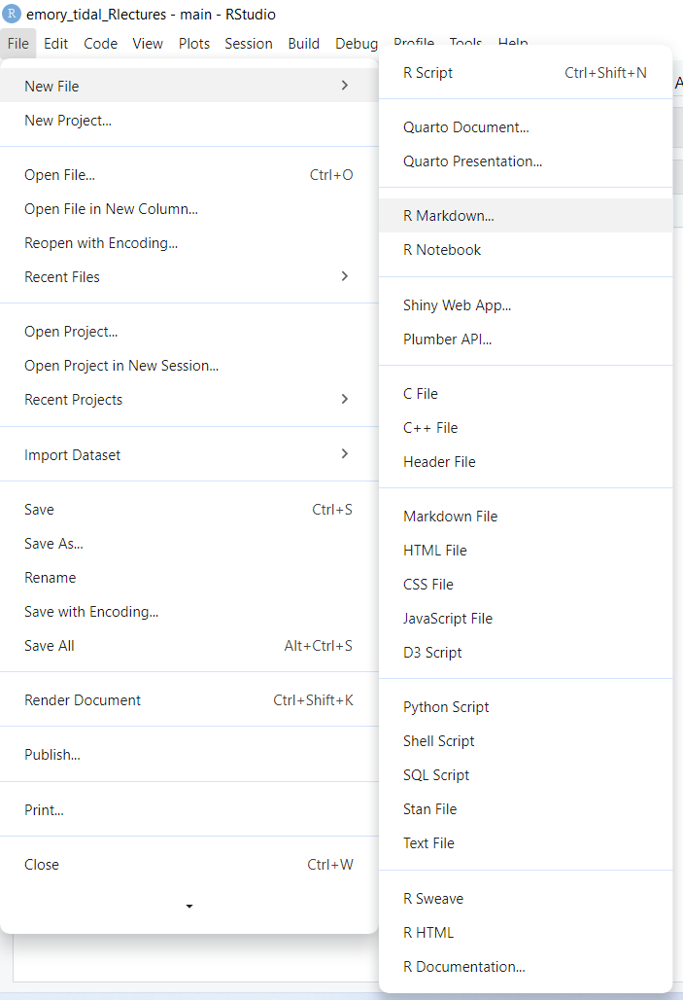
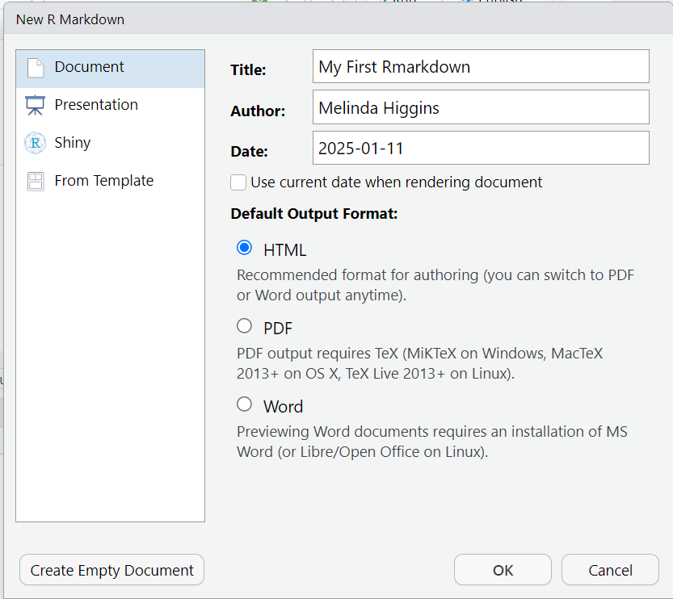
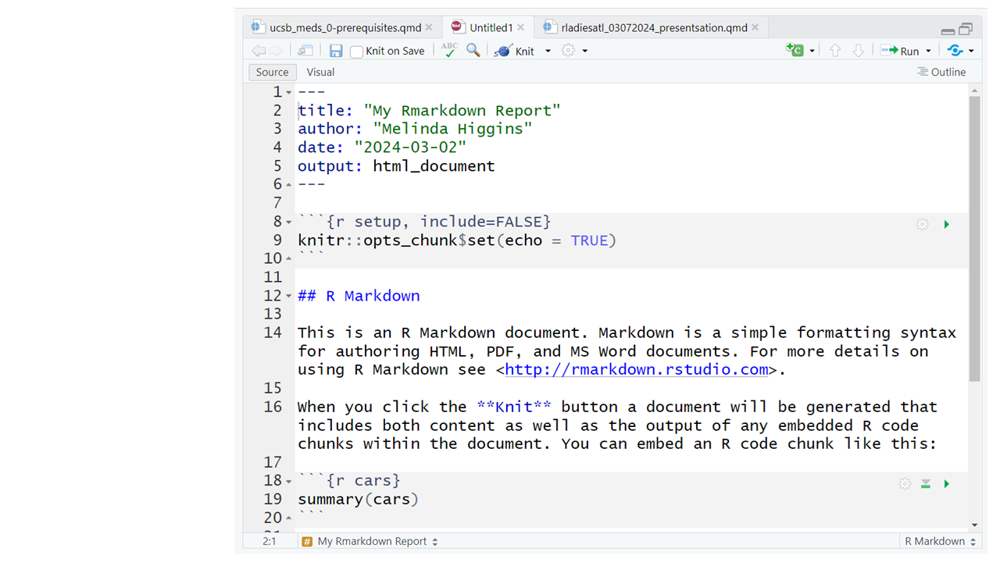
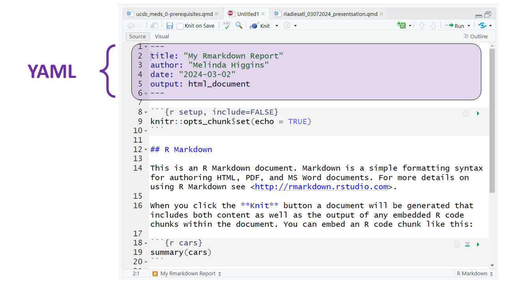
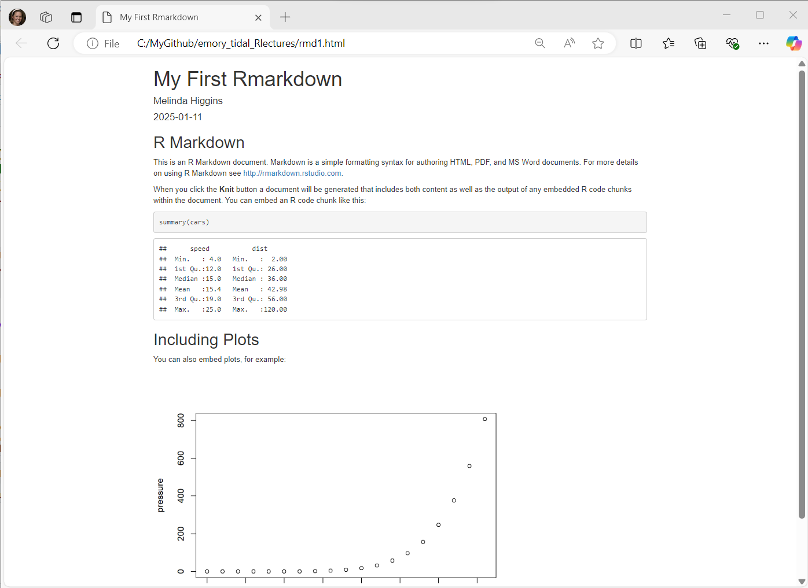

\thispagestyle{fancy}

```{r setup, include=FALSE}
knitr::opts_chunk$set(echo = TRUE,
                      error = TRUE,
                      message = FALSE,
                      warning = FALSE)
knitr::opts_chunk$set(
  comment = '', fig.width = 6, fig.height = 6
)
```

## Session Objectives

1. Create and "Knit" your first Rmarkdown "report"
2. Using parameters to "automate" an Rmarkdown Report

---

## 0. Prework - Before You Begin

* R Packages Needed for this session:
    * [`rmarkdown`](https://rmarkdown.rstudio.com/)
    * [`knitr`](https://yihui.org/knitr/)
    * [`tinytex`](https://yihui.org/tinytex/) - OPTIONAL _needed to "knit to PDF"_

* Rmarkdown Files
    * [`CESDAnalysisReport.Rmd`](CESDAnalysisReport.Rmd)
    * [`CESDAnalysisReport_byRace.Rmd`](CESDAnalysisReport_byRace.Rmd)
    * [`CESDAnalysisReport_RaceParameters.Rmd`](CESDAnalysisReport_RaceParameters.Rmd)
    
* R Data File
    * [`help.Rdata`](help.Rdata)

---

\newpage
## Create and "Knit" your first Rmarkdown "report"

### Create a new Rmarkdown File

Let's take a look at an Rmarkdown file and how we can use it to create a report that combines together `data + code + documentation` to produce a seamless report.

Go to the RStudio menu and click "File/New File/R Markdown":

{width=80%}

\newpage

Type in a title, your name, the date and choose the format you'd like to create. For your first document I encourage you to try HTML. But you can create WORD (DOC) documents and even PDFs. In addition to documents, you can also create slide deck presentations, Shiny apps and other custom products like R packages, websites, books, dashboards and many more. 

::: callout-tip
## Rmarkdown ideas and inspiration

* [Rmarkdown Gallery](https://rmarkdown.rstudio.com/gallery.html){target="_blank"}
* [Rmarkdown Formats](https://rmarkdown.rstudio.com/formats.html){target="_blank"}
* [Rmarkdown Cookbook](https://bookdown.org/yihui/rmarkdown-cookbook/){target="_blank"}
:::

**To get started, use the built-in template:**

* Type in a title
* Type in your name as author
* Choose and output document format
    - HTML is always a good place to start - **only need a browser to read the output `*.html` file.**
    - DOC usually works OK - **but you need MS Word or Open Office installed on your computer.**
    - PDF **NOTE: You need a TEX compiler on your computer** - Learn about installing the `tinytex` [https://yihui.org/tinytex/](https://yihui.org/tinytex/){target="_blank"} R package to create PDFs.

{width=80%}

\newpage

### Rmarkdown sections

Here is the **Example RMarkdown Template** provided by RStudio to help you get started with your first Rmarkdown document.



\newpage

This document consists of the following 3 key sections:

1. YAML (yet another markup language) - this is essentially the metadata for your document and defines elements like the title, author, date and type of output document to be created (HTML in this example).



\newpage

2. R code blocks - the goal is to "interweave" code and documentation so these 2 elements live together. That way the analysis output and any associated tables or figures are updated automatically without having to cut-and-paste from other applications into your document - which is time consuming and prone to human errors.

Notice that the code block starts and ends with 3 backticks ` ``` ` and includes the `{r}` R language designation inside the curly braces. 

::: callout-note
## Rmarkdown

[Rmarkdown](https://rmarkdown.rstudio.com/){target="_blank"} can be used for many different programming languages including `python`, `sas`, and more, see [rmarkdown - language-engines](https://bookdown.org/yihui/rmarkdown/language-engines.html){target="_blank"}.
:::


\newpage

3. Along with the R code blocks, we can also create our document with "marked up (or marked down)" text. [Rmarkdown](https://rmarkdown.rstudio.com/){target="_blank"} is a version of ["markdown"](https://www.markdownguide.org/){target="_blank"} which is a simplified set of tags that tell the computer how you want a piece of text formatted.

For example putting 2 asterisks `**` before and after a word will make it **bold**, putting one `_` underscore before and after a word will make the word _italics_; one or more hashtags `#` indicate a header at certain levels, e.g. 2 hashtags `##` indicate a header level 2.

::: callout-tip
## Rmarkdown Tutorial

I encourage you to go through the step by step tutorial at [https://rmarkdown.rstudio.com/lesson-1.html](https://rmarkdown.rstudio.com/lesson-1.html){target="_blank"}.
:::


\newpage

Here are all 3 sections outlined.


\newpage

At the top of the page you'll notice a little blue button that says "knit" - this will "knit" (or combine) the output from the R code chunks and format the text as "marked up" and produce this HTML file _(which will open in a browser window)_:



### Try Quarto Also

Similar to what we did before, let's also try out a [Quarto](https://quarto.org/) document. Click on File/New File/Quarto Document. Fill out a title and your Author name, keep HTML default format and click Create. Then click "Render" instead of "knit".

[Quarto](https://quarto.org/) has a lot of really neat features. For the most part the syntax you've been using for Rmarkdown will also work for Quarto. You can make documents, slides, books, websites, blogs and more. The website for this [R for SAS Users](https://melindahiggins2000.github.io/StatisticalHorizons_R4SASUsers/) course was all built with [Quarto](https://quarto.org/) and hosted on [Github](https://github.com/melindahiggins2000/StatisticalHorizons_R4SASUsers).

---

\newpage
## Using parameters to "automate" an Rmarkdown Report

This part will be interactive. For this section we will be using these 3 RMD (Rmarkdown) files:

* [`CESDAnalysisReport.Rmd`](CESDAnalysisReport.Rmd)
    - This report lays out an example analysis report for exploring regression models, presenting the model results and displaying a associated figure for the models.
* [`CESDAnalysisReport_byRace.Rmd`](CESDAnalysisReport_byRace.Rmd)
    - This report is essentially the same but adds a `filter()` step to help customize the report based on predefined a dataset filter.
* [`CESDAnalysisReport_RaceParameters.Rmd`](CESDAnalysisReport_RaceParameters.Rmd)
    - This report is essentially the same and still uses a `filter()` step to help customize the report - but the "user" is allowed to choose the parameter settings interactively.

---

\newpage

```{r echo=FALSE}
knitr::write_bib(x = c(.packages()), 
                 file = "packages.bib")
```

## Rmarkdown Files for This Module

* [`CESDAnalysisReport.Rmd`](CESDAnalysisReport.Rmd)
* [`CESDAnalysisReport_byRace.Rmd`](CESDAnalysisReport_byRace.Rmd)
* [`CESDAnalysisReport_RaceParameters.Rmd`](CESDAnalysisReport_RaceParameters.Rmd)

## References

::: {#refs}
:::

## Other Helpful Resources

[**Other Helpful Resources**](./additionalResources.html){target="_blank"}

